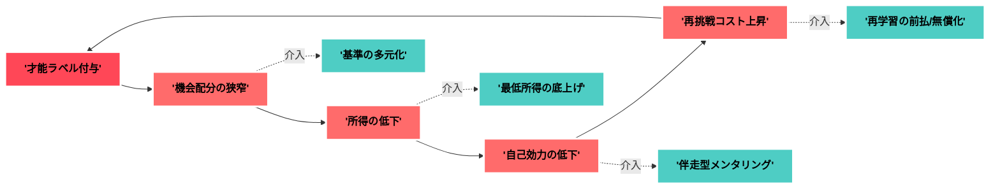
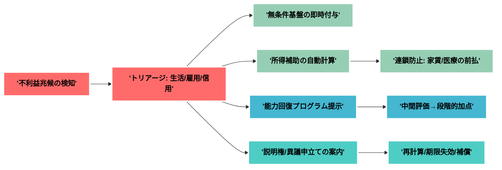

# AI×社会信用スコア時代の行動戦略ドキュメント

**要約（50字）**
AI前提で「自分株式会社」を運営し、スコア時代を設計・分離・監査で乗り切る。

---

## 0. ミニ用語集（抜粋）

| 用語       | 定義（簡潔）           | 狙い/効果      | 具体例           | 指標/関連語    |
| -------- | ---------------- | ---------- | ------------- | --------- |
| AI利用層    | AIを道具として使う層      | 生産性の即時向上   | Copilotでコード補完 | 時短率・品質改善  |
| AI使役層    | AIを設計・運用して成果を生む層 | レバレッジとスケール | 内製エージェント提供    | MRR・自動化率  |
| 自分株式会社   | 個人を会社のように経営する発想  | 多角化と意思決定一貫 | 事業ポートフォリオ管理   | 事業別ARR    |
| デジタルギルド  | 緩やかな職能共同体        | 協業と専門性補完   | Discordで共同開発  | 成果数・参加率   |
| 収益三本柱    | 自動化/ミニSaaS/教育×創作 | 収益安定とリスク分散 | VBA→CLI販売等    | 売上比率      |
| ミニSaaS   | 1課題1機能の小型SaaS    | 低運用で早いPMF  | CSV→帳票生成Web   | 有料転換率・解約率 |
| 自分モデルの蒸留 | 自分の判断軸をAIに圧縮移植   | 作業の半自動化    | 日記から方針抽出Bot   | 自動化率・正答率  |
| DID/VC   | 分散ID/検証可能証明      | 選択的開示と携行性  | 実績のVC化        | 監査可能性     |

> 完全版の用語集は必要に応じて展開可。

---

## 1. 背景と仮説

* **主題**：AIとスコア化で配分設計が変わる。
* **理由**：評価がデータ駆動になり、機会・賃金・信用が連動。
* **具体例**：雇用の事前照会、与信の即時化、行動の動態料率化。
* **まとめ**：**個人の運営力**が生存性を左右する。

---

## 2. 設計思想（生き方のアーキテクチャ）

* **自分株式会社**：個人を事業体として運営。案件依存を回避。
* **デジタルギルド**：緩やかな協業網で専門性を補完。
* **収益三本柱**：①業務自動化、②ミニSaaS、③教育×創作。
* **問いと検証**：プロンプト設計×A/B検証を日課化。
* **意味の維持**：創作と社会貢献で動機を再充填。

---

## 3. 24ヶ月ロードマップ（実装計画）

### 0–90日：**基盤構築**

* VS Code＋GitHub整備、対話ログ資産化、テンプレ整備。
* 三本柱の試作開始（VBA→Python/CLI化、1機能SaaS、技術×小説連載）。
* ギルド参加・週2アウトプット。プロンプトA/B運用。

### 3–6ヶ月：**収益の可視化**

* ミニSaaS有料化、RPAテンプレ3種、講座＋連載の会員化。
* 成果指標（転換率・解約率・工数）を公開し信頼蓄積。
* 依存プラットフォームの**代替策**を並走準備。

### 6–18ヶ月：**半自動化の布石**

* **自分モデルの蒸留**（私的データで軽量エージェント化）。
* 小規模ギルドで共同プロダクト立上げ（災害Tech等）。
* インキュベート枠応募と配分交渉の実地訓練。

### 18–24ヶ月：**資産化と耐久性**

* 収益をARR化、更新耐性のある運用体制に。
* **独自データ**の継続蓄積で参入障壁を形成。
* 創作×貢献を制度化して意味の回復を恒常化。

---

## 4. 社会信用スコア時代の予測（2035→2090）

### タイムライン（要点）

* **2025–27**：分野別スコアの相互参照が進む。
* **2028–31**：DID/VC標準化、選択的開示が普及。
* **2032–35**：統合ダッシュボードとUI化された異議申立て。
* **2045–60**：個人AIが信用交渉代理人化、自動是正が拡大。
* **2060**：用途分離が憲法・条約級に格上げ。
* **2085**：単一スコアから**多元レジャー**へ本格転換。

---

## 5. 「才能なし」ラベリングの帰結と介入

* **メカニズム**：機会狭窄→所得低下→自己効力低下→再挑戦費増。
* **具体像**：低裁量配置、プラットフォーム従属、学習負債。
* **介入**：基準多元化、最低所得フロア、再学習の前払、失効規則。

### 図解（負の循環と介入）

---

## 6. 弱者救済の設計（4層モデル）

### 代表施策（要約）

| 施策          | 目的     | 発動条件     | 仕組み         | リスク       | KPI     |
| ----------- | ------ | -------- | ----------- | --------- | ------- |
| 非スコア公共枠     | 生命線の維持 | 収入/スコア不問 | 公共料金の最低帯    | ただ乗り      | 供給到達率   |
| 最低所得フロア     | 所得の底上げ | 所得<閾値    | 負の所得税/UBI   | 労働意欲低下    | 貧困率     |
| 家賃補助ポータビリティ | 住居安定   | 家賃負担過大   | 家賃の率補助      | 地域偏在      | 退去率     |
| 医療/教育の前払券   | 初期費の除去 | 失業/低所得   | バウチャー制      | 需給歪み      | 受講完了率   |
| 再学習ラダー      | 能力回復   | 連続低スコア   | 段階試験+職務訓練   | スクリーニング誤差 | 再就職率    |
| スコア失効規則     | 永久罰の回避 | 罰点付与     | 期限失効/加点     | モラルハザード   | 失効到達率   |
| 説明権/異議権     | 冤罪訂正   | 不利益処分    | 原因開示+再計算    | 事務遅延      | 是正時間中央値 |
| 監査トレイル      | 乱用抑止   | 一定規模以上   | 外部監査/罰則     | コスト増      | 違反検出率   |
| 用途分離        | 私的制裁防止 | 全域       | 金融/治安/福祉の分離 | 連携漏れ      | 越境利用件数  |
| 代替スコア       | 再挑戦路   | 誤判/履歴不足  | 実績VC/推薦ZK   | 偽装        | 妥当性通過率  |
| 公的オムブズ      | 争訟支援   | 異議申請時    | 無料弁護AI+人手   | 過負荷       | 処理遅延    |
| 信用保険        | 再起費用   | スコア低下    | 保険金で連鎖遮断    | 逆選択       | 保険加入率   |

### 救済フロー（設計図）

---

## 7. 個人ストラテジー（攻めと守り）

### 設計（Design the score）

* 実績を**VC**化し携行。選択的開示で最小提示。
* **反証パッケージ**（記録・証跡・推薦）を事前用意。

### 分離（Separate contexts）

* 金融・雇用・コミュニティIDを**論理分離**。
* 連携は**一時トークン**で橋渡し。用途条項を厳読。

### 監査（Auditability）

* 同意レシート、アクセスログ自己監査、期限失効の管理。
* 誤判時の異議申立て動線と文面テンプレを保持。

---

## 8. 主要KPIと運用指標

| カテゴリ | 指標                | 目的        |
| ---- | ----------------- | --------- |
| 収益   | MRR/ARR、解約率、転換率   | 継続性評価     |
| 生産   | 工数/件、失敗率、リードタイム   | ボトルネック除去  |
| 自動化  | 自動化率、介入回数、完了件数    | エージェント有効性 |
| 信用   | 異議是正時間、誤判率、用途逸脱検出 | リスク低減     |
| 意味   | 創作継続日数、貢献アクション数   | 動機維持      |

---

## 9. 5年刻み 未来予測・救済設計（図解）

### 図解1：社会信用スコア採用と設計の推移（2025→2090）

```mermaid
flowchart LR
  Y2025["2025: '相互参照の拡大'\n・'分野別スコア連携PoC'\n・'DID/VCの試行'"] -->
  Y2030["2030: '実務運用の定着'\n・'採用/金融/保険で即時照会'\n・'選択的開示の導入'"] -->
  Y2035["2035: '標準化期（分水嶺）'\n・'統合ダッシュボードUI'\n・'異議申立ての制度化'"]:::core -->
  Y2040["2040: '監査整備'\n・'説明権/異議権の実効化'\n・'用途分離の準則化'"] -->
  Y2045["2045: '救済の標準化'\n・'失効規則（3–7年）一般化'\n・'AI公設弁護＋人手審査'"]:::good -->
  Y2050["2050: '自動是正の普及'\n・'誤判検知→自動再計算'\n・'信用保険の商品化'"] -->
  Y2055["2055: '国際相互運用拡張'\n・'越境VC検証'\n・'データ移転SLA'"] -->
  Y2060["2060: '分離原則の憲法化'\n・'治安/金融/福祉の厳格分離'\n・'違反に強制罰'"]:::core -->
  Y2065["2065: 'データ信託の一般化'\n・'弱者の交渉力集約'\n・'用途越境の継続低下'"] -->
  Y2070["2070: '代理人社会の定着'\n・'個人AIが信用交渉代理'\n・'常時監視で即時異議'"] -->
  Y2075["2075: '文脈限定同意の高度化'\n・'短命トークン運用'\n・'監査APIの普及'"] -->
  Y2080["2080: '多元レジャー化の前夜'\n・'単一スコアの形骸化'\n・'領域別台帳の準備'"] -->
  Y2085["2085: 'ポストスコア転換'\n・'多元レジャー本格運用'\n・'自己主権バリデーション'"]:::core -->
  Y2090["2090: '安定期'\n・'説明不能案件<0.1%目標'\n・'国際救済相互承認'"]:::good

  classDef core fill:#FF4757,stroke:#fff,stroke-width:3px,color:#000,font-weight:bold
  classDef good fill:#4ECDC4,stroke:#fff,stroke-width:3px,color:#000,font-weight:bold
```

### 図解2：弱者救済「4層モデル」成熟カーブ（5年刻み）

```mermaid
flowchart TD
  subgraph L1["'層1: 無条件基盤（非スコア公共枠）'"]
    L1_2025["'2025: 部分導入'"] --> L1_2030["'2030: 都市圏拡大'"] --> L1_2035["'2035: 標準化'"] --> L1_2045["'2045: 国際人権へ明記'"]:::good --> L1_2060["'2060: 憲法級の保障'"]:::core --> L1_2090["'2090: 安定運用'"]
  end

  subgraph L2["'層2: 所得補助（負の所得税/UBIフロア）'"]
    L2_2025["'2025: 実証段階'"] --> L2_2030["'2030: 条件付き導入'"] --> L2_2040["'2040: 動態フロア'"] --> L2_2050["'2050: 家賃/医療の連動'"]:::good --> L2_2065["'2065: 越境ポータビリティ'"] --> L2_2085["'2085: 多元台帳と連携'"]
  end

  subgraph L3["'層3: 能力回復（再学習ラダー/職務再設計）'"]
    L3_2025["'2025: バウチャー試行'"] --> L3_2035["'2035: 標準カリキュラム'"] --> L3_2045["'2045: 仕事内評価と統合'"]:::good --> L3_2055["'2055: 個人AI伴走'"] --> L3_2070["'2070: 常時診断→即時補助'"]
  end

  subgraph L4["'層4: 監査・救済（説明権/異議/失効/代替スコア）'"]
    L4_2025["'2025: 異議権の整備'"] --> L4_2035["'2035: UI化/ダッシュボード'"]:::good --> L4_2045["'2045: 自動是正の拡大'"] --> L4_2060["'2060: 用途分離の憲法化'"]:::core --> L4_2080["'2080: 多元レジャー監査'"] --> L4_2090["'2090: 相互承認ネット'"]
  end

  classDef good fill:#96CEB4,stroke:#fff,stroke-width:3px,color:#000,font-weight:bold
  classDef core fill:#FF4757,stroke:#fff,stroke-width:3px,color:#000,font-weight:bold
```

### 図解3：個人ストラテジー成熟（設計→分離→監査）

```mermaid
flowchart LR
  P2025["'2025: 設計の初期化'\n・'実績のVC化着手'\n・'用途制限表の作成'"]:::pillars -->
  P2030["'2030: 分離の実装'\n・'仕事/私用ID分離'\n・'一時トークン橋渡し'"]:::guild -->
  P2035["'2035: 監査の定着'\n・'同意レシート/アクセスログ自己監査'\n・'異議テンプレ整備'"]:::core -->
  P2040["'2040: 半自動化'\n・'誤判検知→自動異議申立て'\n・'信用保険加入'"] -->
  P2045["'2045: 代理人化'\n・'個人AIが信用交渉代理'\n・'即時再計算連携'"] -->
  P2060["'2060: 分離憲法化対応'\n・'用途越境検出SLA'\n・'監査API連携'"]:::core -->
  P2085["'2085: 多元レジャー対応'\n・'文脈限定同意の常時運用'\n・'自己主権バリデーション'"]:::pil_high -->
  P2090["'2090: 最適化'\n・'説明不能案件<0.1%'\n・'国際救済相互承認に適合'"]:::good

  classDef core fill:#FF4757,stroke:#fff,stroke-width:3px,color:#000,font-weight:bold
  classDef good fill:#4ECDC4,stroke:#fff,stroke-width:3px,color:#000,font-weight:bold
  classDef guild fill:#45B7D1,stroke:#fff,stroke-width:3px,color:#000,font-weight:bold
  classDef pillars fill:#FFEAA7,stroke:#fff,stroke-width:3px,color:#000,font-weight:bold
  classDef pil_high fill:#DDA0DD,stroke:#fff,stroke-width:3px,color:#000,font-weight:bold
```

---

## 10. 早期準備チェックリスト

* [ ] **データ棚卸し**（収集元・保有先・保持期間）
* [ ] **用途制限表**（誰に何を出すか/出さないか）
* [ ] **異議申立てテンプレ**（文面・証跡・時系列）
* [ ] **実績のVC化**（資格・納品・推薦）
* [ ] **分離環境**（仕事/私用のID・支払いの分離）
* [ ] **監視指標**（誤判率・是正時間・用途外検出）

---

## 11. まとめ

* **主題**：AI×スコア時代は「個の運営」が核心。
* **理由**：配分・賃金・信用が連動し、意思決定の質が成果を決める。
* **具体例**：三本柱で収益を平準化し、DID/VCで証跡を携行・分離。
* **結語**：\*\*設計（Design）×分離（Separate）×監査（Audit）\*\*で優位を築く。

---

## 12. 行動指針（あなた用）

### 原則（5つ）

1. **設計**：公開可能な実績を常時VC化し、最小提示を徹底する。
2. **分離**：用途別ID・支払い・データを論理分離し、橋渡しは一時トークン。
3. **監査**：同意レシートとアクセスログを自己監査し、異議動線を常備。
4. **多角化**：収益は自動化/ミニSaaS/教育×創作の三本柱で運営。
5. **意味**：創作と社会貢献を週次で制度化し、動機を維持。

### 今日

* 既存VBAの**1本**を**CLI化**してGitHubへ。READMEにユースケースとKPIを記載。
* **用途制限表**の初版を作成（提出先×提示項目×根拠）。

### 今週

* 1機能SaaSの**課金骨組み**を実装（登録/課金/解約/ログ）。
* **異議申立てテンプレ**を作成（事実/根拠/再計算要求/期限）。
* ギルドで**週2アウトプット**（進捗/学習メモ/デモ）。

### 今月

* 主要実績の**VC化**（資格・納品・推薦の3系統）。
* **信用保険/緊急基金**の枠組みを設定（目安3ヶ月生活費）。
* 自分モデル**蒸留ノート**を開始（判断ルール/失敗ログ）。

### 90日

* ミニSaaSを**有料公開**し、**転換率/解約率/サポート工数**を可視化。
* RPAテンプレ**3種**を整備（要件→設定→保守のSLA付き）。
* **アクセスログ自己監査**を自動化（逸脱検知のアラート）。

### 年内（12ヶ月）

* 軽量**自分エージェント**で半自動化を実装（誤判検知→異議起票）。
* **共同プロダクト**を1本立上げ、**配分交渉**の実地訓練。
* **独自データ**を継続蓄積（二次創作不可の実測/注釈）。

> 必要なら、この行動指針を**週次レビュー板**（カンバン）に落とし込み、KPI/SLAを接続します。
