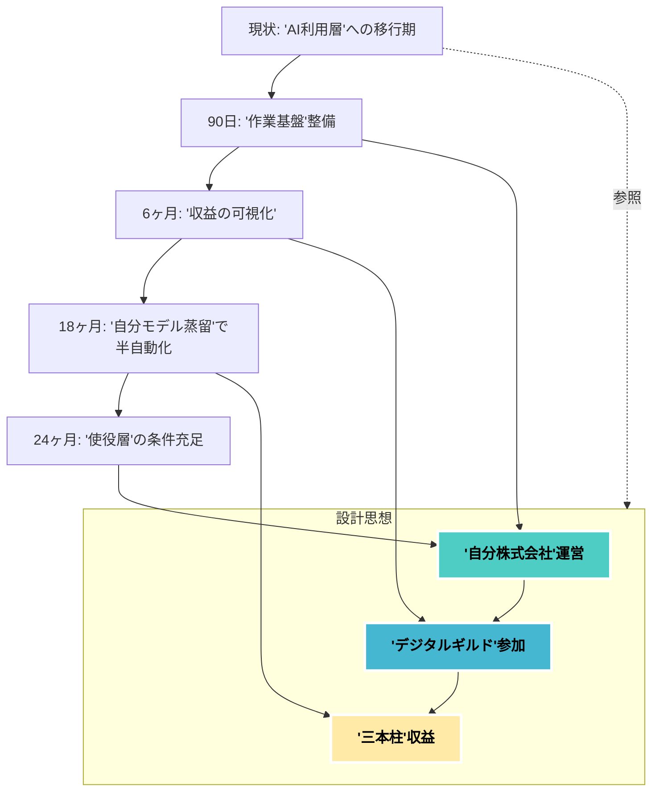
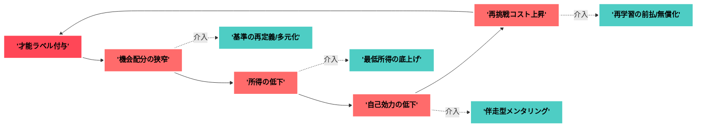

**要約**
AI前提社会で「自分株式会社」を運営し、AI利用層→使役層へ段階遷移する計画を実装する。収益の柱を3本化し、リスクを分散する。&#x20;

---

## 概要

**主題**：AI時代を前提に生き方を最適化する。
**理由**：社会はAI関与度で三極化し、非関与は不利である。
**具体例**：AI活用で職能を商品化し、ギルド型で連携する。
**まとめ**：短期はAI利用層、長期はAI使役層を狙う。

---

## 背景と設計思想

**前提**：才能資本主義への移行で、個人の価値が直接評価される。
**設計思想**：

* 「自分株式会社」を運営し、案件依存を避ける。
* デジタルギルドに参加し、プロジェクト単位で協業する。
* 収益源を3本化し、平時に学び直しを継続する。
* 意味喪失を避け、創作と社会貢献で動機を維持する。

---

## 手順（実装計画）

### 0〜90日：**AI利用層の土台**

* **AI連携の作業基盤**を整備する。
  例：VS Code＋GitHub、対話ログ管理、プロンプト資産化。
* **3本柱の試作**を同時並行で着手。

  1. **業務自動化**：VBA⇄Python橋渡しで小ツール販売。
  2. **Web実装**：RailsでミニSaaSを1本公開。
  3. **知識×物語**：技術解説＋小説の連載枠を開設。
* **問いの訓練**を日課化する。
  目的：指示の精度で成果が決まるため。
* **ギルド参加**：同領域のSlack/Discordへ週2アウトプット。

### 3〜6ヶ月：**収益の見える化**

* **SaaS**：1機能特化の有料化（例：CSV→帳票生成）。
* **自動化**：社内向けRPAテンプレを3種に整理。
* **教育コンテンツ**：短編講座＋小説で月額会員を試行。
* **創造性・協働性**の鍛錬を定期ワークにする。
* **販売ページ**に成果指標を明記し、信頼を蓄積。
* **リスク評価**：プラットフォーム依存度を毎月点検。

### 6〜18ヶ月：**AI使役層への布石**

* **自分モデルの蒸留**：自領域の私的データで軽量エージェント。
  目的：自分の判断基準を内蔵した作業自律化。
* **小規模ギルド**で**共同プロダクト**を立ち上げる。
  例：災害Techや自治体向けの可視化基盤。
* **企業のインキュベート枠**を獲得し、配分交渉を学ぶ。

### 18〜24ヶ月：**資産化と耐久性**

* **収益3本柱**を**ARR化**し、更新に強い設計へ。
* **二次創作不可の独自データ**を蓄積し、参入障壁を形成。
* **意味の回復**：創作×社会貢献の定例活動を制度化。

---

## 図解（遷移マップ）

※「自分株式会社」「ギルド」は原文の要点。&#x20;

---

## 実装の細目（あなた向け最適化）

### 収益三本柱の定義

1. **業務自動化**：

* VBA資産をPython/CLI化し、企業向けに提供。
* KPI：時短実績、導入社数、継続率。

2. **ミニSaaS**：

* Railsで1課題1機能の徹底。運用コスト最小。
* KPI：有料転換率、解約率、サポート工数。

3. **教育×創作**：

* 技術解説と小説を束ねた会員制。
* KPI：継続日数、読了率、コミュニティ活性。

### スキル投資の優先度

* **問い**：日次でプロンプト設計のA/B検証。
* **創造性**：異分野連結の企画を月2本。
* **協働性**：レビュー会の定例化。

### リスク管理（守り）

* **プラットフォーム依存**の棚卸しと代替案の用意。
* **デジタルデバイド**回避の学習計画を維持。
* **意味の空洞化**対策に、創作と貢献を週次に組み込む。
* **社会制度の変動**を前提に現金比率・保険・地域ネットも確保。

---

## まとめ

**主題**：AI時代は個人経営の発想が核となる。
**理由**：才能の直接評価とギルド化が進むため。&#x20;
**具体例**：三本柱で収益を平準化し、使役層条件を満たす。
**結語**：短期でAI利用層を固め、長期で使役層に登る。選んだ価値観が未来を分ける。

---

### 次の一手（今日やること3つ）

* 既存VBAの**1本**をCLI化し、配布形にする。
* Railsで**1機能**のSaaS骨組みを作る。
* プロンプト**A/B**テンプレを作り、毎日検証する。

必要なら、この計画を**週次レビュー板**に落とします。レビュー軸を一緒に設計しましょう。

---

**要約**
才能ラベルの負循環と分岐を示し、帰結を整理。

---

## 概要

**主題**：才能「なし」判定は周辺化を招く。
**理由**：機会・報酬・自己効力の循環が崩れる。
**具体例**：低賃金化→選好固定→再挑戦費増。
**まとめ**：分岐はあるが放置で格差が硬直化。

---

## 前提と定義

* **才能**は文脈依存で多次元。測定は偏る。
* **判定**は配分装置。就学・雇用・与信に波及。
* **AI時代**は可視化とスコア化で影響が増幅。

---

## メカニズム（因果の骨子）

1. **ラベリング**：期待低下→機会の内的放棄。
2. **スクリーニング**：資格・スコアで弾かれる。
3. **賃金圧力**：自動化補助で替えが利く扱い。
4. **プラットフォーム従属**：手数料で収益流出。
5. **社会資本の希薄化**：紹介・助け舟が消える。
6. **学習負債**：再学習の初期費が障壁になる。

---

## 想定される帰結（生活像）

* **就業**：補助的・反復業務へ集約。交代制が増。
* **所得**：時給依存型。景気弾力性が高く不安定。
* **居住**：周縁地域へ偏在。移動コストが重い。
* **健康**：裁量の乏しさ→ストレス・慢性疲労。
* **アイデンティティ**：無力感→選好の防衛的固定。
* **政治参加**：離脱かポピュリズム的動員に偏る。
* **家計**：サブスク過多・延滞・高利サービス依存。
* **デジタル**：監視的KPIで罰点回避に意識が集中。

---

## シナリオ分岐

* **悲観**：低スコア階層の恒常化。相続格差が継承。
* **中庸**：公的再学習と職務再設計で微上昇。
* **楽観**：人間接点・現場判断の価値が再評価。

---

## 図解（負の循環と介入点）

---

## 分野別の変化とセーフガード

| 分野   | 変化         | バッドケース  | セーフガード           |
| ---- | ---------- | ------- | ---------------- |
| 雇用設計 | 低裁量・高監視の配置 | 使い捨て化   | **職務再設計**と裁量枠    |
| 評価   | 単一スコアに収斂   | 選抜の硬直   | **多元評価**・ポートフォリオ |
| 学習   | 初期費で断念     | 学習負債の累積 | **前払/成果払い**の再学習  |
| 所得   | 変動幅が大      | 支出の負債化  | **フロア賃金/UBI**の検討 |
| 健康   | 時間不規則      | 生活習慣病   | **予防医療×勤務設計**    |
| 社会資本 | つながり希薄     | 孤立化     | **ギルド/互助**の制度化   |

---

## 具体像（3型）

* **プラットフォーム下請型**：単価は即時だが上限低い。
* **現場ケア型**：対人力で安定も感情労働が重い。
* **公共補助型**：雇用は守られるが賃金は伸びにくい。

---

## 不確実性

* アルゴリズム監査・再分配政策の有無で大きく変動。
* 文化的規範（再挑戦容認度）の差も影響。
* 定量根拠は地域差が大。**追加調査が必要**。

---

## まとめ

**主題**：才能判定は生活全域を形作る。
**理由**：配分・賃金・心理の循環が連動する。
**具体例**：低裁量就業とスコア従属が増える。
**結語**：介入設計次第で分岐は可逆的になり得る。

---

**用語集**

---

| 用語           | 定義（簡潔）           | 狙い/効果      | 具体例            | 指標/関連語    |
| ------------ | ---------------- | ---------- | -------------- | --------- |
| AI利用層        | AIを道具として使う層      | 生産性の即時向上   | Copilotでコード補完  | 時短率・品質改善  |
| AI使役層        | AIを設計・運用して成果を生む層 | レバレッジとスケール | 内製エージェント提供     | MRR・自動化率  |
| 自分株式会社       | 個人を会社のように経営する発想  | 多角化と意思決定一貫 | 事業ポートフォリオ管理    | 事業別ARR    |
| デジタルギルド      | 緩やかな職能共同体        | 協業と専門性補完   | Discordで共同開発   | 成果数・参加率   |
| 収益三本柱        | 自動化/ミニSaaS/教育×創作 | 収益安定とリスク分散 | VBA→CLI販売等     | 売上比率      |
| ミニSaaS       | 1課題1機能の小型SaaS    | 低運用で早いPMF  | CSV→帳票生成Web    | 有料転換率・解約率 |
| ARR          | 年間経常収益           | 収益持続性の評価   | MRR×12         | ARR成長率    |
| 自分モデルの蒸留     | 自分の判断軸をAIに圧縮移植   | 作業の半自動化    | 日記から方針抽出Bot    | 自動化率・正答率  |
| AIエージェント     | 自律的にタスク遂行するAI    | 繰返し作業の委任   | チケット処理Bot      | 介入回数・完了件数 |
| プロンプト設計      | AIへの指示を設計・最適化    | 出力品質の最大化   | 役割/制約の明示       | 再現率・修正回数  |
| A/B検証        | 2案比較の実証実験        | 最適化の裏付け    | プロンプトAとB比較     | 成功率・CTR   |
| KPI          | 重要業績指標           | 進捗の定量管理    | 継続率・時短時間       | 目標値・達成率   |
| RPA          | ルール作業の自動化        | 人手削減と品質安定  | 請求データ転記        | 人時削減・誤差率  |
| CLI          | 文字ベース操作IF        | 自動化と再現性    | Python製ツール実行   | 実行時間・失敗率  |
| Rails        | Webフレームワーク       | 開発の高速化     | CRUDなSaaS実装    | リードタイム    |
| VBA          | Office向け自動化言語    | 業務効率化      | 帳票整形マクロ        | 時短時間      |
| Python       | 汎用言語             | 自動化/データ処理  | ETLスクリプト       | 実行時間      |
| GitHub       | ソース管理/協業基盤       | 変更履歴と公開    | Pull Request運用 | Issue解決速度 |
| VS Code      | エディタ             | 生産性と拡張性    | Lint/AI補完      | 開発効率      |
| 意味の空洞化       | 動機が成果主義で痩せる状態    | バーンアウト回避   | 技術×小説連載        | 主観満足・継続度  |
| デジタルデバイド     | IT格差             | リスク低減      | 週次学習計画         | スキル到達度    |
| 収益の可視化       | 収益構造の開示          | 信頼獲得と学習    | 売上内訳公開         | 透明性・CVR   |
| 作業基盤         | ツール/手順の土台        | 再現性と拡張性    | テンプレ/スクリプト群    | セットアップ時間  |
| ギルド参加        | コミュニティ発信         | 協業機会創出     | 週2アウトプット       | 反応数・誘致数   |
| 参入障壁         | 競合が真似しにくい壁       | 優位性維持      | 独自データ保有        | 追随難度      |
| 二次創作不可の独自データ | 許諾外利用されにくい資産     | 価値の専有      | 実測ログ/注釈        | データ希少性    |
| インキュベート枠     | 育成支援プログラム枠       | 資源獲得と成長    | 企業の新規事業枠       | 採択率       |
| 配分交渉         | 取り分の交渉           | 公平なインセンティブ | レベニューシェア       | 契約条件      |
| 共同プロダクト      | 複数人で作る製品         | 補完と速度      | 災害Techダッシュボード  | 出荷速度      |
| プラットフォーム依存   | 特定基盤への過度依存       | 変更耐性の確保    | API代替準備        | 依存度       |
| 週次レビュー板      | 週次の可視化ボード        | 振り返り固定化    | カンバン運用         | 完了率       |
| リスク分散        | 損失を抑える設計         | 事業継続性      | 三本柱運営          | 相関・分散     |
| 社会貢献         | 社会的価値の創出         | 意味と信頼の獲得   | 災害支援可視化        | 参加者・影響    |
| 意味の回復        | 物語性の回復行為         | 動機の再点火     | 創作習慣化          | 継続日数      |
| 有料転換率        | 無料→有料の移行割合       | 収益性の把握     | トライアル→課金       | CVR       |
| 解約率          | 有料解約の割合          | 継続性の指標     | 月次解約           | Churn     |
| 継続率          | 継続利用の割合          | ロイヤルティ把握   | サブスク継続         | Retention |
| サポート工数       | サポートに要する時間       | 運用コスト管理    | 問い合わせ対応        | 工数/件      |
| MRR          | 月次経常収益           | 収益安定性      | サブスク収入         | ARR換算     |
| 対話ログ管理       | AI対話の資産化         | 再利用と学習     | プロンプト/出力の保存    | 検索性       |
| 才能資本主義       | 才能が価値の源泉となる社会    | 直接評価の促進    | 作品/成果で評価       | 作品指標      |

---

必要なら、CSV/スプレッドシート版に整形します。列や粒度の調整も可能です。
