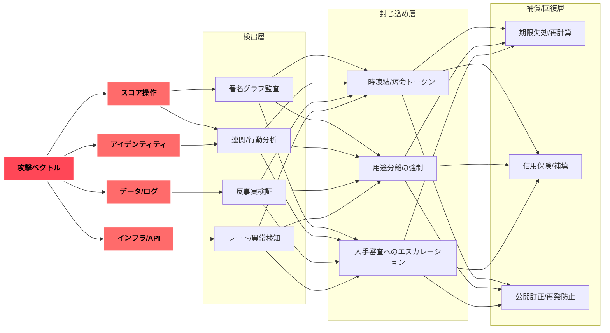
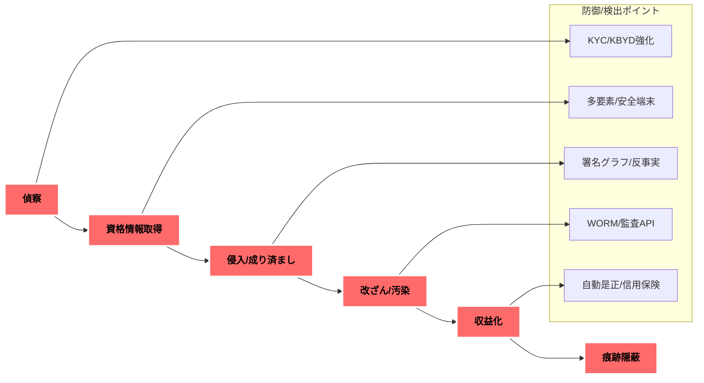

# スコア社会で予想される犯罪リスクと対策

**要約（50字）**
スコア操作・身元詐称・データ汚染が主軸。多層防御と監査で抑制する。

---

## 1. 前提と視座

* **主題**：社会信用スコア普及下の犯罪を体系化。
* **前提**：DID/VC・選択的開示・用途分離が標準化へ。
* **視座**：技術×制度×経済で攻防を設計する。

---

## 2. 犯罪分類マップ（カテゴリー）

1. **スコア操作犯罪**：偽実績、相互加点リング、スコア洗浄。
2. **アイデンティティ犯罪**：合成ID、VC奪取、身代わり開示。
3. **データ犯罪**：データ毒入（ポイズニング）、ログ改ざん。
4. **インフラ犯罪**：ウォレット/ダッシュボード乗っ取り、API濫用。
5. **内部犯**：監査人の買収、モデル閾値の恣意変更。
6. **金融派生**：信用デリバティブ悪用、保険金詐欺、与信アービトラージ。
7. **社会工学**：恐喝（スコア降下の脅し）、詐称代理人、偽の異議代行。

---

## 3. 代表シナリオ（要約表）

| 犯罪名     | メカニズム       | 主要ターゲット      | 影響         | 初期兆候        | 想定対策         |
| ------- | ----------- | ------------ | ---------- | ----------- | ------------ |
| 相互加点リング | 相互署名で偽レピュ構築 | フリーランス/小規模事業 | 与信/採用の歪み   | 短期に相互署名集中   | 署名グラフ監査・重み付け |
| スコア洗浄   | マルチIDで履歴分断  | 低スコア者        | 過去不利益の隠匿   | 新IDで高額取引急増  | 連関分析・一時凍結    |
| 合成ID    | 実在断片を合成     | 金融/保険        | 架空口座・給付詐取  | 住所/端末の非整合   | 強制KBYD・生体併用  |
| VC奪取    | ウォレット侵害     | 個人/企業        | 一括開示・成り済まし | 未知端末の一括請求   | 安全端末限定・多要素   |
| データ毒入   | 偽ログを大量投入    | モデル/監査       | 誤判の体系化     | 一部ソースだけ急増   | ソース多様化・反事実検証 |
| ログ改ざん   | 監査証跡の書換     | 監査/法執行       | 追跡不能       | タイムスタンプ不整合  | 署名付きWORM保管   |
| API濫用   | 限界超の照会      | 事業者          | 帯域/料金被害    | 短時間の高頻度照会   | レート制御・SLA監査  |
| 監査人買収   | 内部者の取引      | 規制/企業        | 閾値変更/隠蔽    | 閾値の不自然変更    | 多重承認・外部監査    |
| 保険金詐欺   | スコア低下を偽装    | 保険/金融        | 不正支払い      | 直前の行動パターン変異 | 行動相関・待機期間    |
| 恐喝型脅迫   | 「降格する」と脅し   | 個人           | 即金要求/評判毀損  | 社交DMでの脅迫連鎖  | 法執行API・即遮断   |
| 偽異議代行   | 代行装う詐欺      | 庶民層          | 手数料詐取/情報窃取 | 有料相談の一斉広告   | 認定代行制度・名簿公開  |

---

## 4. 攻撃ベクトルと防御層（図解）



---

## 5. 犯罪の経済（収益化ルート）

* **即金型**：恐喝、偽代行、口座抜き取り。
* **積上型**：相互加点リングの売買、与信枠転売。
* **高度型**：合成IDでの長期育成→大型詐取。
* **二次市場**：盗取VC/ログの闇市場流通。

---

## 6. 5年刻み 犯罪進化予測（2025→2090）

```mermaid
flowchart LR
  Y2025["2025: 初期攻撃"\n"偽レピュ/偽異議代行/簡易乗っ取り"] -->
  Y2030["2030: 連携悪用"\n"相互加点リング/スコア洗浄/合成ID"] -->
  Y2035["2035: 標準化と対抗"\n"監査強化⇄内部犯の巧妙化"] -->
  Y2040["2040: 自動化攻防"\n"自動是正の回避/遅延攻撃"] -->
  Y2045["2045: 代理人の悪用"\n"詐称AI代理/同意の偽装"] -->
  Y2050["2050: 国際化"\n"越境スキーム/多法域アービトラージ"] -->
  Y2055["2055: 金融深耕"\n"信用デリバティブの不正操作"] -->
  Y2060["2060: 分離憲法化後"\n"越境用途/監査API攻撃"] -->
  Y2065["2065: データ信託期"\n"信託乗っ取り/委任権乱用"] -->
  Y2070["2070: 常時監査期"\n"監査妨害/観測回避最適化"] -->
  Y2075["2075: 文脈同意高度化"\n"短命トークン連鎖悪用"] -->
  Y2080["2080: 多元レジャー前夜"\n"領域間乖離の搾取"] -->
  Y2085["2085: ポストスコア"\n"台帳間写像の偽装/検証撹乱"] -->
  Y2090["2090: 安定期の残余リスク"\n"超長期潜伏/ニッチ攻撃"]

  classDef default fill:#FFEAA7,stroke:#fff,stroke-width:3px,color:#000,font-weight:bold
```

---

## 7. ガバナンスと法執行の論点

* **用途分離**の罰則実効性と域外適用。
* **監査API**の独立性とログのWORM保管。
* **異議申立てSLA**と救済の自動補償。
* **認定代行制度**と名簿/失格ルールの公開。
* **外部監査の二重化**（技術監査×市民監視）。

---

## 8. 個人・組織の実務対策（チェックリスト）

* [ ] **用途制限表**：提出先×提示項目×根拠を明文化。
* [ ] **同意レシート**：署名付きで保存、第三者検証可能に。
* [ ] **アクセスログ自己監査**：逸脱検知の自動アラート。
* [ ] **代替スコア準備**：実績VC・推薦ZKの別系統を保有。
* [ ] **異議テンプレ**：事実/根拠/再計算要求/期限を定型化。
* [ ] **安全端末/金庫**：開示は安全端末限定＋物理隔離。
* [ ] **信用保険/緊急基金**：連鎖遮断の資金を確保。

---

## 9. 付録：犯罪キルチェーン（図解）



---

## 10. 一言まとめ

**主題**：スコア社会の犯罪は「操作・詐称・汚染」。
**対策**：**検出→封じ込め→補償**の多層で回す。
**行動**：小さく実装し、監査可能性を常に上げる。
