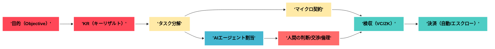

# 主要産業別・労働構造の将来予測（AI×スコア時代）

**要約（50字）**
主要産業は"'核（IP/規約/品質）'"集中と"'ネットワーク化'"で再編。雇用→契約へ。

---

## 1. 前提と横断トレンド

* **主題**：個人化・エージェント化・スコア化が労働構造を再設計する。
* **理由**："'検収の自動化（VC/ZK）'"と"'即時決済'"により、"'マイクロ契約'"が成立。
* **具体例**："'DAO/ギルド'"で人材プール化、"'核＋フラクタル企業'"で周縁を拡張。
* **まとめ**："'雇用'"は縮小し、"'参加権/レベニューシェア'"が増える。

---

## 2. 横断マップ（主要産業×再編ドライバー）

| 産業        | 自動化率（2035→2060） | エージェント比率 | 契約形態の主流       | 組織アーキタイプ     | 人間の中核職能         | 主リスク       | セーフガード      |
| --------- | --------------- | -------- | ------------- | ------------ | --------------- | ---------- | ----------- |
| 製造        | 中→高             | 高        | "'SLA/成果物契約'" | "'核＋フラクタル'"  | 原価設計/安全/品質監査    | サプライ網攪乱    | 監査API/用途分離  |
| IT・ソフト    | 高→高             | 高        | "'マイクロ契約'"    | スタジオ/DAO/ギルド | 仕様/アーキ/評価設計     | 供給過剰/品質散逸  | 検収VC/レピュ監査  |
| 金融        | 中→高             | 高        | "'遵守条件付き契約'"  | プロトコル企業/DAO  | リスク/規制アービトラージ抑制 | 内部犯/合成ID   | KBYD/二重監査   |
| 医療・介護     | 低→中             | 中        | "'ケアSLA＋出来高'" | データ信託/協同     | 倫理/説明/最終判断      | 差別/保険逆選択   | 失効規則/人手審査   |
| 教育        | 中→高             | 高        | "'モジュール受講契約'" | ギルド/スタジオ     | カリキュラム/評価基準     | 低品質MOOC    | 認証VC/第三者評価  |
| 物流・小売     | 高→高             | 高        | "'動的SLA'"     | 核＋フラクタル      | 最終50m/例外処理      | ラストワンマイル事故 | 責任境界の明文化    |
| 建設・不動産    | 低→中             | 中        | "'段階検収契約'"    | 共同体/公共DAO    | 施工監理/安全・環境      | 請負多重化      | WORM記録/保証金  |
| メディア・エンタメ | 中→高             | 高        | "'IP/分配契約'"   | スタジオ/DAO     | 世界観/編集/コミュ運営    | 生成物の氾濫     | 著作VC/出典監査   |
| 農業・食品     | 低→中             | 中        | "'出来高＋品質SLA'" | 協同/信託        | 土地判断/ローカル連携     | 天候/衛生      | センサーVC/追跡台帳 |
| 公共・防災     | 低→中             | 中        | "'成果連動契約'"    | 準公共OS/公共DAO  | 配分/説明責任         | プライバシ/政治摩擦 | 用途分離/外部監査   |

> 注：比率は相対評価。地域/規制で差異が出る。

---

## 3. 産業別の将来予測（2030/2035/2045/2060/2085）

### 3.1 製造

* **2030**："'合成SaaS＋ロボティクス'"で少人数運転。"'検収VC'"が導入。
* **2035**："'核（IP/規約）'"集中。工場は"'フラクタルチーム'"に分解。
* **2045**："'双方向SLA'"でサプライ網の自動是正。"'信用保険'"が標準。
* **2060**："'用途分離'"が法制化。監査は"'API＋WORM'"で常時。
* **2085**："'多元レジャー'"で品質・安全・環境の別台帳管理。
  **KPI**："'検収確度'"、"'停止時間中央値'"、"'逸脱是正時間'"。

### 3.2 IT・ソフトウェア

* **2030**：ソロ×エージェントで"'マイクロ機能'"を量産。
* **2035**："'スタジオ×DAO'"ハイブリッドが主流。"'レベニューシェア'"普及。
* **2045**：中間管理は"'個人AI'"へ。人は"'アーキ/評価/交渉'"に集中。
* **2060**："'分離原則'"憲法化後、ログ連携が厳格化。
* **2085**："'多元台帳'"で品質・安全・説明の各証跡を分離提出。
  **KPI**："'合同行動速度'"、"'再検収率'"、"'依存度指数'"。

### 3.3 金融

* **2030**："'即時与信'"と"'動態料率'"が一般化。
* **2035**："'KBYD'"（"'Know-By-Your-Data'"）が常識に。"'合成ID'"対策が主戦場。
* **2045**："'信用デリバティブ'"の健全化枠組み整備。
* **2060**：用途越境への"'強制罰'"。データ信託が与信交渉で台頭。
* **2085**："'台帳間写像'"の監査が常設。国際相互承認が前提に。
  **KPI**："'誤判率'"、"'是正時間'"、"'越境検出率'"。

### 3.4 医療・介護

* **2030**：遠隔/在宅の"'トリアージAI'"定着。人は"'説明と同意'"に注力。
* **2035**："'ケアSLA'"が明確化。"'差別防止'"と"'失効規則'"が整備。
* **2045**：患者側"'データ信託'"で治療選択が増える。
* **2060**："'用途分離'"厳格化。研究/保険/治療のログ分離。
* **2085**：文脈限定の同意が常時運用。説明不能は<0.1%を目標。
  **KPI**："'予後改善度'"、"'同意の完全性'"、"'苦情→是正時間'"。

### 3.5 教育

* **2030**："'モジュール学習'"＋"'達成VC'"が普及。人はメタ認知コーチへ。
* **2035**："'公的/民間の学習台帳'"が接続。受講→職務が自動連携。
* **2045**："'現場評価'"と"'再学習バウチャー'"の統合。
* **2060**：国際互換の"'学習ID'"。用途越境に強罰。
* **2085**：多元レジャーで能力の文脈提示が標準。
  **KPI**："'到達度'"、"'転用率'"、"'再学習までの遅延'"。

### 3.6 物流・小売

* **2030**：需要予測×自律配送が拡大。人は例外処理担当。
* **2035**："'動的SLA'"と"'即時補償'"が標準化。
* **2045**：最後の"'50m'"に地域DAOが参入。
* **2060**："'用途分離'"遵守の監査強化。広告/決済/物流の連結に壁。
* **2085**：プライバシ保護型リテール。"'一時トークン'"が常態化。
  **KPI**："'配送成功率'"、"'補償時間'"、"'在庫回転'"。

### 3.7 建設・不動産

* **2030**：BIM×現場AIで検収の半自動化。
* **2035**："'段階検収契約'"が標準。事故/環境SLAが明確に。
* **2045**：公共DAOが"'入札→検収'"を運営。
* **2060**："'用途分離'"で賃貸・信用・地域評価を分離。
* **2085**：都市OSで賃貸/税/防災が自動整合。
  **KPI**："'欠陥率'"、"'検収遅延'"、"'安全指標'"。

### 3.8 メディア・エンタメ

* **2030**：生成と編集が分業。コアは"'編集/世界観/コミュ運営'"。
* **2035**："'IP/分配契約'"が細分化。二次創作の境界が透明化。
* **2045**：ファンDAOが制作委員会に並ぶ。
* **2060**：著作VCと出典監査が常識化。
* **2085**：多元台帳で権利関係が即時整合。
  **KPI**："'再利用率'"、"'出典整合率'"、"'コミュ継続率'"。

### 3.9 農業・食品

* **2030**：センサー×予測で施肥/収穫最適化。人は地域連携に注力。
* **2035**："'出来高＋品質SLA'"が明確化。追跡台帳が普及。
* **2045**：協同組合×データ信託で販路拡大。
* **2060**：国際標準履歴で輸出の非関税障壁を緩和。
* **2085**：気候リスク連動の保険×信用が統合。
  **KPI**："'歩留まり'"、"'リコール時間'"、"'価格乖離'"。

### 3.10 公共・行政/防災

* **2030**：可視化プラットフォームで参加型予算が拡大。
* **2035**："'準公共OS'"と"'公共DAO'"が実装。異議→再計算がUI化。
* **2045**：救済SLA（"'是正時間'"上限）が法定化。
* **2060**：用途分離の憲法化。域外違反に制裁が可能に。
* **2085**：国際相互承認で災害支援が即時連携。
  **KPI**："'是正時間'"、"'誤判率'"、"'救済到達率'"。

---

## 4. 図解：価値連鎖の再配列（共通ワークフロー）

---

## 5. 産業横断のKPI/SLA雛形

| 区分     | KPI例                 | SLA/基準例                  |
| ------ | -------------------- | ------------------------ |
| 品質     | "'再検収率'"、"'欠陥率'"     | "'再検収率<2%'"、"'欠陥率<0.5%'" |
| 速度     | "'合同行動速度'"           | "'企画→契約→着手<=72h'"        |
| ガバナンス  | "'是正時間'"、"'用途越境検出率'" | "'是正<=14日'"、"'越境ゼロ容認'"   |
| レジリエンス | "'依存度指数'"            | "'単一点依存<40%'"            |
| 参加/粘着  | "'再参加率'"、"'貢献分布'"    | "'上位10%の集中<50%'"         |

> 具体値は産業/地域ごとに調整。

---

## 6. まとめ

* **主題**：各産業は"'核（IP/規約/品質）'"に集中し、周縁を"'ネットワーク（DAO/ギルド/ソロ）'"で補完。
* **理由**：検収と決済の自動化が進み、マイクロ契約の摩擦が低下。
* **具体例**："'検収VC'"、"'監査API'"、"'動的SLA'"により、雇用から参加権へ。
* **結語**：人間は"'設計/評価/倫理/交渉/コミュニティ'"に集中し、エージェントが反復作業を担う。

---

## 7. あなたの行動指針（個人最適）

* **産業選定**：上表から関心産業を"'2つ'"選び、KPI/SLAを逆算してスキル設計。
* **証跡化**：成果を"'VC'"で発行し、"'選択的開示'"で提示。
* **契約OS**："'見積→契約→検収→決済'"の自動フローを小規模PoC。
* **ギルド参加**：各産業のギルド/準公共DAOに"'週2アウトプット'"。
* **レジリエンス**："'依存度指数'"を四半期点検し、代替手段を常備。
