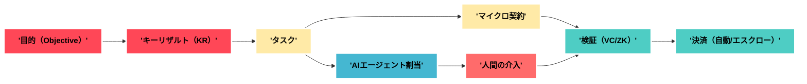
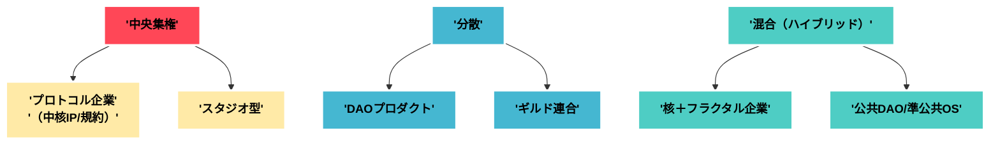

# 個人化社会の企業像と未来の労働構造予測

**要約（50字）**
個人主権×エージェント化で企業は「核＋ネットワーク」へ再編、DAO等が補完。

---

## 1. 前提と定義

* **主題**：個人化社会で企業・組織・労働がどう再設計されるかを予測。
* **定義**：

  * **個人化社会**：個人が「自分株式会社」として事業・信用・データを運営する社会。
  * **DAO**（Decentralized Autonomous Organization）：**ルール自動執行**＋**分散ガバナンス**の組織形態。
  * **エージェント労働**：AIエージェントが作業・調整・監査を担う労働様式。

---

## 2. 変化ドライバー（設計要因）

* **AIの使役化**（設計→実行→監査の自動化）。
* **信用の可搬化**（DID/VC・選択的開示）。
* **コストの極小化**（無サーバ/ノーコード/合成SaaS）。
* **支払いの即時化**（オンチェーン/プログラマブル決済）。
* **規制のコード化**（監査API/用途分離）。

---

## 3. 組織アーキタイプ（7型）

| 型           | 概要                           | 強み       | 脆さ       | 主なユースケース       |
| ----------- | ---------------------------- | -------- | -------- | -------------- |
| 核＋フラクタル企業   | 中核がIP/ブランドを保持し、周縁フラクタルチームで拡張 | 速度と拡張性   | 品質の散逸    | コンテンツ/ゲーム/消費財  |
| ギルド連合       | 技能ギルド間の連合。共有規約＋相互審査          | 人材プール    | 意思決定の遅さ  | 受託/専門職サービス     |
| DAOプロダクト    | トークン/会員権で参加と報酬を自動配分          | コミュニティ駆動 | トークン設計の難 | オープンインフラ/標準化   |
| スタジオ型企業     | ベンチャー・スタジオで連続的に新規事業を孵化       | 再現性      | 人材依存     | 新規SaaS/合成SaaS  |
| ソロ企業群（ソロレバ） | 個人がエージェントと外注で小規模に高利益         | 固定費の小ささ  | ブランド脆弱   | ニッチSaaS/教育/自動化 |
| データ信託/協同組合  | データの共同所有・収益分配                | 交渉力      | ガバナンスコスト | 医療/まちづくり       |
| 公共DAO/準公共OS | 公共財の保守にDAOを活用                | 透明性      | 政治的摩擦    | 都市/交通/防災       |

---

## 4. 契約・報酬・管理の再設計

* **契約単位**："'ジョブ'"→"'タスク'"→"'マイクロ契約'"→"'SLA/成果物'"へ細分化。
* **報酬形態**：フィアット＋安定通貨＋"'レベニューシェア'"＋評価トークン（ベスティング）。
* **検収**："'検証可能証明（VC）'"＋"'ZK'"で納品証跡を付与。
* **ガバナンス**：しきい値署名/多重承認、"'用途分離'"の契約条項。
* **監査**："'同意レシート'"＋アクセスログのWORM保管、"'監査API'"。

---

## 5. 労働構造（ワークフロー・スタック）

---

## 6. 5年刻み 未来予測（**2025→2090**）

```mermaid
flowchart LR
  Y2025["'2025'\n・'個人×AIでソロ企業増'\n・'DAOは一部領域で有用'\n・'VC/選択的開示が普及'" ] -->
  Y2030["'2030'\n・'核＋フラクタル企業が台頭'\n・'ギルド連合の受託増'\n・'合成SaaSで固定費縮小'" ] -->
  Y2035["'2035'\n・'統合ダッシュボードで労務/与信が接続'\n・'公共DAOの試行拡大'\n・'マイクロ契約が標準化'" ]:::core -->
  Y2040["'2040'\n・'個人AIが中間管理職化'\n・'検収はVC/ZK前提'\n・'レベニューシェア普及'" ] -->
  Y2045["'2045'\n・'データ信託/協同が主流'\n・'越境プロジェクトが平常化'" ]:::good -->
  Y2050["'2050'\n・'公共インフラの一部を公共DAOが運営'\n・'企業はIP/規約/品質の中核に特化'" ] -->
  Y2055["'2055'\n・'監査APIが国際標準'\n・'人手審査は高次判断へ'" ] -->
  Y2060["'2060'\n・'用途分離が憲法・条約級に'\n・'労働IDの越境互換が完成'" ]:::core -->
  Y2065["'2065'\n・'エージェント間取引が主流'\n・'人は企画/倫理/交渉へ集中'" ] -->
  Y2070["'2070'\n・'スタジオ×DAOのハイブリッドが覇権'\n・'多層レベニュー配分が定着'" ] -->
  Y2075["'2075'\n・'短命トークン/一時権限が常態化'\n・'流動チームが即日編成'" ] -->
  Y2080["'2080'\n・'単一企業境界の形骸化'\n・'領域別レジャーで信用管理'" ] -->
  Y2085["'2085'\n・'多元台帳で労務/税務が自動整合'\n・'自己主権バリデーション常時化'" ]:::core -->
  Y2090["'2090'\n・'企業=プロトコル＋ブランドの集合'\n・'雇用は極少、契約と参加権が中心'" ]:::good

  classDef core fill:#FF4757,stroke:#fff,stroke-width:3px,color:#000,font-weight:bold
  classDef good fill:#4ECDC4,stroke:#fff,stroke-width:3px,color:#000,font-weight:bold
```

---

## 7. 役割別インパクト

| アクター         | ポジ変化          | ネガ変化         | 必要能力             |
| ------------ | ------------- | ------------ | ---------------- |
| 個人（ソロ/小規模）   | 固定費低/越境案件     | レピュ/現金繰りの脆弱  | VC運用/プロンプト/交渉    |
| 既存企業         | 変動費化/外部タレント活用 | 文化/監査/品質管理が難 | 標準化/SLA/エコシステム設計 |
| スタートアップ/スタジオ | 連続起業が容易       | 人材の分散で粘着性低   | ベスティング/共有IP      |
| 公共/自治体       | 可視化/参加型開発     | 政策摩擦/責任境界    | 公共DAO/監査API運用    |

---

## 8. リスクとセーフガード

* **断片化**："'品質基準'"の不整合→"'共通SLA'"と"'監査API'"。
* **不安定収入**：景気弾力性↑→"'最低フロア'"と"'信用保険'"。
* **内部犯/買収**：多重承認＋外部監査＋"'用途分離の罰則'"。
* **スコア差別**："'失効規則'"と"'代替スコア'"の制度化。

---

## 9. 組織KPI（新しい物差し）

| 項目    | 例            | 目的        |
| ----- | ------------ | --------- |
| 合同速度  | 企画→契約→着手の中央値 | 市場適応力     |
| 検収確度  | 再検収率/誤判率     | 品質安定      |
| 依存度指数 | 取引先/基盤の集中度   | レジリエンス    |
| 参加粘着  | メンバー再参加率     | コミュニティ健全性 |
| 監査健全  | 異常検知→是正時間    | ガバナンス実効性  |

---

## 10. 参考アーキ図：組織トポロジー

---

## 11. まとめ

**主題**：企業は"'核（IP/規約/品質）'"に集中し、周縁は"'ネットワーク（DAO/ギルド/ソロ）'"で拡張。
**理由**：信用の可搬化とエージェント化で、境界が透過化するため。
**具体例**：マイクロ契約×VC検収×自動決済。
**結語**："'プロトコルとしての企業'"が標準になり、雇用は参加権と収益分配に置換される。

---

## 12. 次の一手（個人/チーム向け）

* **規約設計**："'共通SLA'"と"'用途分離'"条項のテンプレを整備。
* **VC運用**：納品証跡を"'検証可能証明'"として発行・保管。
* **契約OS**：見積→契約→検収→決済の自動フローをPoC。
* **ギルド/DAO**：2–3団体に参加し、役割と評価軸を理解。
* **エージェント**：タスク割当/監査の"'個人AI'"を試作。
