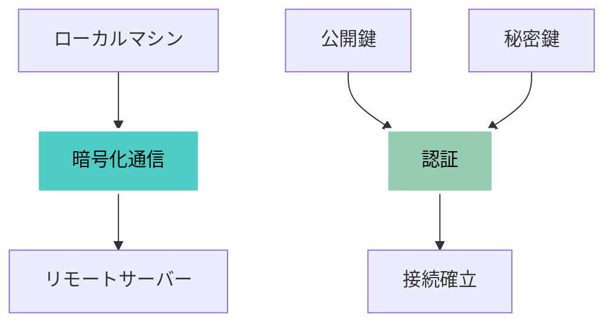
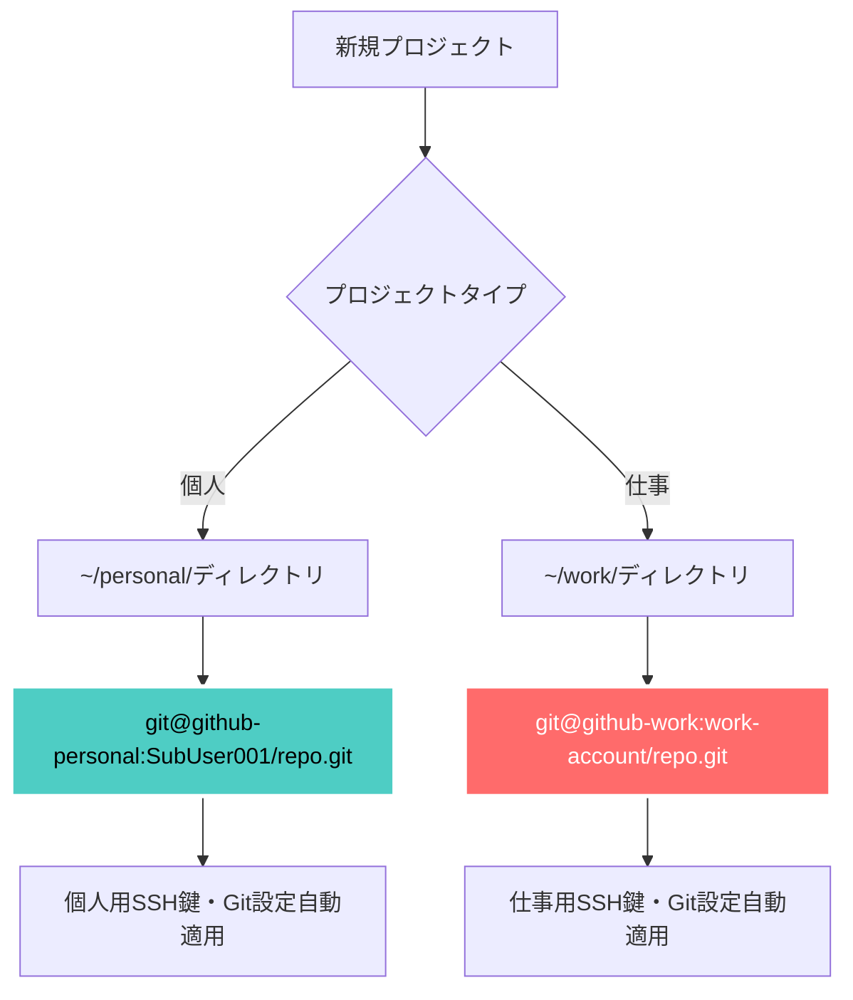

# Git/GitHub 基礎ハンズオン - 完全実践ガイド

## 📋 概要

Gitは分散型バージョン管理システム、GitHubはGitリポジトリのホスティングサービスです。コード変更の履歴管理、チーム開発、オープンソース貢献において必須のツールです。

**習得目標**: 個人開発からチーム協働まで、実務で使える Git/GitHub スキルの完全習得

---

## 🎯 背景と設計思想

Gitは2005年にLinux開発者Linus Torvaldsが作成しました。設計思想は以下の3原則に基づきます：

- **分散性**: 各開発者が完全なリポジトリコピーを持つ
- **高速性**: ローカル操作による高速なバージョン管理
- **データ整合性**: SHA-1ハッシュによる完全性保証

従来の中央集権型とは異なり、オフライン作業や柔軟なワークフローが可能です。

---

## 🔧 手順1: 環境セットアップ

### Git初期設定

```
# ユーザー情報設定
git config --global [user.name](http://user.name) "Your Name"
git config --global [user.email](http://user.email) "[your.email@example.com](mailto:your.email@example.com)"

# エディタ設定（VSCode使用例）
git config --global core.editor "code --wait"

# 設定確認
git config --list
```

### GitHubアカウント作成とSSH設定

```
# SSH鍵生成
ssh-keygen -t ed25519 -C "[your.email@example.com](mailto:your.email@example.com)"

# SSH鍵をGitHubに登録（公開鍵をコピー）
cat ~/.ssh/id_[ed25519.pub](http://ed25519.pub)

# SSH接続テスト
ssh -T [git@github.com](mailto:git@github.com)
```

**⚠️ 重要**: SSH鍵は必ずGitHubの Settings > SSH and GPG keys で登録してください。

---

## 📊 図解1: Git基本ワークフロー

```
flowchart TD
    A[ワーキングディレクトリ<br/>作業中のファイル] --> |git add| B[ステージングエリア<br/>コミット準備エリア]
    B --> |git commit| C[ローカルリポジトリ<br/>履歴保存エリア]
    C --> |git push| D[リモートリポジトリ<br/>GitHub/GitLab等]
    D --> |git pull| C
    C --> |git checkout| A
    
    E[他の開発者] --> |git clone| F[ローカルコピー]
    F --> |git push| D
    D --> |git fetch/pull| C
    
    %% 高コントラスト配色
    style A fill:#FF6B6B,stroke:#fff,stroke-width:3px,color:#fff,font-weight:bold
    style B fill:#FFEAA7,stroke:#fff,stroke-width:3px,color:#333,font-weight:bold
    style C fill:#4ECDC4,stroke:#fff,stroke-width:3px,color:#fff,font-weight:bold
    style D fill:#45B7D1,stroke:#fff,stroke-width:3px,color:#fff,font-weight:bold
    style E fill:#96CEB4,stroke:#fff,stroke-width:3px,color:#333,font-weight:bold
    style F fill:#DDA0DD,stroke:#fff,stroke-width:3px,color:#fff,font-weight:bold
```

**理解ポイント**:

- **赤色**: 編集中のファイル（未保存状態）
- **黄色**: コミット待ちファイル（保存準備完了）
- **水色**: 確定済み履歴（バックアップ完了）
- **青色**: チーム共有エリア（公開状態）

---

## 🛠️ 手順2: 基本コマンド実践

### リポジトリ作成と基本操作

```
# 新しいリポジトリ初期化
mkdir my-project
cd my-project
git init

# ファイル作成とコミット
echo "# My Project" > [README.md](http://README.md)
git add [README.md](http://README.md)
git commit -m "初回コミット: READMEを追加"

# リモートリポジトリ追加
git remote add origin [git@github.com](mailto:git@github.com):username/my-project.git
git push -u origin main
```

### ブランチ操作の基本

```
# 新しいブランチ作成・移動
git checkout -b feature/new-feature

# ファイル変更
echo "新機能の説明" >> [README.md](http://README.md)
git add [README.md](http://README.md)
git commit -m "新機能: README更新"

# メインブランチにマージ
git checkout main
git merge feature/new-feature
git push origin main

# ブランチ削除
git branch -d feature/new-feature
```

**⭐ 実践のコツ**: コミットメッセージは「動詞: 具体的な変更内容」の形式で統一しましょう。

---

## 📊 図解2: Gitブランチ戦略

```
flowchart TD
    A["初期コミット<br/>main"] --> B["ログイン機能追加<br/>feature/login"]
    A --> C["ダッシュボード作成<br/>feature/dashboard"]
    
    B --> D["バリデーション追加<br/>feature/login"]
    C --> E["グラフ機能追加<br/>feature/dashboard"]
    
    D --> F["ログイン機能マージ<br/>main"]
    A --> F
    
    E --> G["ダッシュボードマージ<br/>main"]
    F --> G
    
    G --> H["セキュリティ修正<br/>hotfix/security"]
    H --> I["緊急修正マージ<br/>main"]
    G --> I
    
    %% ブランチ別配色 - 高コントラスト
    style A fill:#45B7D1,stroke:#fff,stroke-width:3px,color:#fff,font-weight:bold
    style F fill:#45B7D1,stroke:#fff,stroke-width:3px,color:#fff,font-weight:bold
    style G fill:#45B7D1,stroke:#fff,stroke-width:3px,color:#fff,font-weight:bold
    style I fill:#45B7D1,stroke:#fff,stroke-width:3px,color:#fff,font-weight:bold
    
    style B fill:#96CEB4,stroke:#fff,stroke-width:3px,color:#333,font-weight:bold
    style D fill:#96CEB4,stroke:#fff,stroke-width:3px,color:#333,font-weight:bold
    
    style C fill:#FFEAA7,stroke:#fff,stroke-width:3px,color:#333,font-weight:bold
    style E fill:#FFEAA7,stroke:#fff,stroke-width:3px,color:#333,font-weight:bold
    
    style H fill:#FF6B6B,stroke:#fff,stroke-width:3px,color:#fff,font-weight:bold
```

**戦略解説**:

- **feature/**: 新機能開発用ブランチ
- **hotfix/**: 緊急修正用ブランチ
- **main**: 安定版リリースブランチ

---

## 🤝 手順3: GitHub協働機能

### Pull Request (PR) ワークフロー

```
# フォークしたリポジトリでの作業
git clone [git@github.com](mailto:git@github.com):your-username/original-repo.git
cd original-repo

# 上流リポジトリ追加
git remote add upstream [git@github.com](mailto:git@github.com):original-owner/original-repo.git

# 最新変更を取得
git fetch upstream
git checkout main
git merge upstream/main

# 機能ブランチで開発
git checkout -b feature/awesome-feature
# 開発作業...
git push origin feature/awesome-feature
```

### Issues活用とプロジェクト管理

- **Issues**: バグ報告、機能要求、タスク管理
- **Projects**: カンバンボード、マイルストーン管理
- **Actions**: CI/CD自動化、テスト実行

---

## 📊 図解3: GitHub協働ワークフロー

```
sequenceDiagram
    participant Dev1 as 開発者A
    participant GitHub as GitHub
    participant Dev2 as 開発者B
    participant CI as CI/CD
    
    Dev1->>GitHub: 1. リポジトリ作成
    Dev1->>GitHub: 2. 初期コミットpush
    
    Dev2->>GitHub: 3. リポジトリfork
    Dev2->>Dev2: 4. ローカルにclone
    
    Dev2->>Dev2: 5. feature branchで開発
    Dev2->>GitHub: 6. Pull Request作成
    
    Dev1->>GitHub: 7. コードレビュー
    Note over Dev1,GitHub: レビューコメント<br/>修正依頼
    
    Dev2->>GitHub: 8. 修正コミット
    CI->>GitHub: 9. 自動テスト実行
    
    Dev1->>GitHub: 10. レビュー承認
    Dev1->>GitHub: 11. マージ実行
    
    GitHub->>CI: 12. デプロイトリガー
    CI->>CI: 13. 本番環境更新
    
    Note over Dev1,CI: 高品質なソフトウェア開発サイクル
```

**重要な流れ**: Fork → Clone → 開発 → PR → レビュー → マージ → デプロイ

---

## 🎓 手順4: 実践演習

### 演習1: 個人プロジェクト（30分）

1. ✅ GitHubで新しいリポジトリ作成
2. ✅ ローカルでHTMLファイル作成（index.html）
3. ✅ 複数回のコミットとプッシュ（最低3回）
4. ✅ ブランチ作成とマージ（feature/styles）

### 演習2: チーム開発シミュレーション（45分）

1. ✅ パートナーのリポジトリをフォーク
2. ✅ 新機能を別ブランチで開発
3. ✅ Pull Request作成（詳細な説明付き）
4. ✅ コードレビューとマージ

**成功指標**: PRが正常にマージされ、履歴が整理されている状態

---

## 📚 重要コマンド一覧

### 基本操作

```
git init                    # リポジトリ初期化
git clone <url>            # リポジトリ複製
git add <file>             # ステージング追加
git commit -m "message"    # コミット作成
git push origin <branch>   # リモートにプッシュ
git pull origin <branch>   # リモートから取得
```

### ブランチ操作

```
git branch                 # ブランチ一覧
git branch <name>          # ブランチ作成
git checkout <branch>      # ブランチ切り替え
git checkout -b <branch>   # 作成して切り替え
git merge <branch>         # ブランチマージ
git branch -d <branch>     # ブランチ削除
```

### 履歴確認

```
git log                    # コミット履歴
git log --oneline          # 簡潔な履歴
git status                 # 現在の状態
git diff                   # 変更差分
```

---

## 🚨 よくあるトラブルと解決法

### 1. コミットメッセージを間違えた

```
git commit --amend -m "正しいメッセージ"
```

### 2. 間違ったファイルをコミットした

```
git reset HEAD~1           # 直前のコミットを取り消し
git reset --soft HEAD~1    # コミットのみ取り消し（変更は保持）
```

### 3. マージコンフリクトが発生

```
# コンフリクトファイルを手動修正後
git add <resolved-file>
git commit -m "コンフリクト解決"
```

### 4. リモートとローカルが同期できない

```
git fetch origin           # リモートの状態を確認
git pull --rebase origin main  # リベースでマージ
```

---

# SSH（Secure Shell）と複数GitHubアカウント管理ガイド

## SSHとは何か

### 概要

- *SSH（Secure Shell）**は、ネットワーク経由で他のコンピュータに安全に接続するためのプロトコルです。暗号化された通信により、パスワードやデータの盗聴を防ぎます。

### SSHの仕組み



### 公開鍵認証の利点

- **パスワード不要**: SSH鍵ペアによる認証
- **高セキュリティ**: 暗号化された通信
- **自動認証**: 一度設定すれば手動入力不要
- **複数アカウント対応**: 鍵を使い分けて複数サービス利用可能

## SSH鍵の基本概念

### 鍵ペアの構造

```bash
# 秘密鍵（ローカルに保管、絶対に共有しない）
~/.ssh/id_ed25519

# 公開鍵（サーバーに登録、共有OK）
~/.ssh/id_ed25519.pub

```

### 認証プロセス

1. **鍵生成**: ローカルで秘密鍵・公開鍋のペアを作成
2. **公開鍵登録**: GitHubに公開鍵を登録
3. **認証**: 接続時に秘密鍵で署名、公開鍵で検証
4. **接続確立**: 認証成功後、暗号化通信開始

## 複数GitHubアカウントのSSH設定

### 前提条件

- 個人アカウント: `SubUser001`
- 仕事アカウント: `work-account`（例）

### 1. SSH鍵ペアの生成

```bash
# 個人用SSH鍵生成
ssh-keygen -t ed25519 -C "personal@example.com" -f ~/.ssh/id_ed25519_personal

# 仕事用SSH鍵生成
ssh-keygen -t ed25519 -C "work@company.com" -f ~/.ssh/id_ed25519_work

```

**パラメータ説明:**

- `t ed25519`: 最新の暗号化アルゴリズム使用
- `C "email"`: コメント（識別用）
- `f path`: 鍵ファイルの保存先指定

### 2. SSH設定ファイル作成

```bash
# SSH設定ファイル編集
nano ~/.ssh/config

```

**設定内容:**

```
# 個人用GitHubアカウント
Host github-personal
    HostName github.com
    User git
    IdentityFile ~/.ssh/id_ed25519_personal
    IdentitiesOnly yes

# 仕事用GitHubアカウント
Host github-work
    HostName github.com
    User git
    IdentityFile ~/.ssh/id_ed25519_work
    IdentitiesOnly yes

```

**設定項目説明:**

- `Host`: カスタムホスト名（任意の名前）
- `HostName`: 実際の接続先（github.com）
- `User`: SSH接続ユーザー（常にgit）
- `IdentityFile`: 使用するSSH秘密鍵のパス
- `IdentitiesOnly`: 指定した鍵のみ使用

### 3. GitHubへの公開鍵登録

```bash
# 個人用公開鍵をクリップボードにコピー
pbcopy < ~/.ssh/id_ed25519_personal.pub

# 仕事用公開鍵をクリップボードにコピー
pbcopy < ~/.ssh/id_ed25519_work.pub

```

**GitHubでの登録手順:**

1. 各アカウントでGitHubにログイン
2. Settings → SSH and GPG keys → New SSH key
3. 対応する公開鍵を貼り付けて保存

### 4. SSH接続テスト

```bash
# 個人用アカウント認証テスト
ssh -T git@github-personal
# 期待する出力: Hi SubUser001! You've successfully authenticated...

# 仕事用アカウント認証テスト
ssh -T git@github-work
# 期待する出力: Hi work-account! You've successfully authenticated...

```

## Gitリポジトリでの使用方法

### アカウント別リモートURL設定

```bash
# 個人プロジェクトの場合
git remote add origin git@github-personal:SubUser001/personal-project.git

# 仕事プロジェクトの場合
git remote add origin git@github-work:work-account/work-project.git

```

### Git設定の使い分け

```bash
# 個人プロジェクト用設定
git config user.name "SubUser001"
git config user.email "personal@example.com"

# 仕事プロジェクト用設定
git config user.name "Work Name"
git config user.email "work@company.com"

```

## 自動化設定（推奨）

### ディレクトリベース自動切り替え

```bash
# プロジェクト整理
~/personal/    # 個人プロジェクト用
~/work/        # 仕事プロジェクト用

```

**~/.gitconfig に追加:**

```
[includeIf "gitdir:~/personal/"]
    path = ~/.gitconfig-personal
[includeIf "gitdir:~/work/"]
    path = ~/.gitconfig-work

```

**~/.gitconfig-personal:**

```
[user]
    name = SubUser001
    email = personal@example.com

```

**~/.gitconfig-work:**

```
[user]
    name = Work Name
    email = work@company.com

```

## アカウント使い分けフロー



## 実践例

### 新規プロジェクト作成手順

```bash
# 1. 個人プロジェクトの場合
cd ~/personal/
git init my-personal-project
cd my-personal-project
git remote add origin git@github-personal:SubUser001/my-personal-project.git

# 2. 仕事プロジェクトの場合
cd ~/work/
git init work-project
cd work-project
git remote add origin git@github-work:work-account/work-project.git

```

### 設定確認コマンド

```bash
# SSH設定確認
cat ~/.ssh/config

# Git設定確認
git config user.name
git config user.email

# リモート設定確認
git remote -v

# SSH認証テスト
ssh -T git@github-personal
ssh -T git@github-work

```

## トラブルシューティング

### よくある問題と解決策

**問題1: Permission denied**

```bash
# 原因: 間違ったSSH鍵が使用されている
# 解決: リモートURLのHost名確認
git remote -v

```

**問題2: Repository not found**

```bash
# 原因: リポジトリが存在しないか、アクセス権限がない
# 解決: GitHubでリポジトリ存在確認・権限確認

```

**問題3: 間違ったアカウントで認証される**

```bash
# 原因: SSH設定ファイルの問題
# 解決: ~/.ssh/config の設定確認・修正

```

## セキュリティベストプラクティス

### SSH鍵管理

- **秘密鍵は絶対に共有しない**
- **定期的な鍵のローテーション**
- **不要な鍵の削除**
- **強力なパスフレーズ設定**

### ファイル権限設定

```bash
# SSH設定ファイルの権限
chmod 600 ~/.ssh/config

# SSH鍵の権限
chmod 600 ~/.ssh/id_ed25519_*
chmod 644 ~/.ssh/id_ed25519_*.pub

```

この設定により、複数のGitHubアカウントを効率的かつ安全に使い分けることができます。

## 🎯 まとめ

Git/GitHubは現代開発における必須インフラです。**個人作業での履歴管理からチーム協働まで**、段階的に習得することで開発効率が劇的に向上します。

**次のステップ**:

1. 毎日のコミット習慣化（Green Squares目標）
2. オープンソースプロジェクトへの貢献
3. Git Flow, GitHub Flow等の高度なワークフロー習得

**重要な心構え**: 「失敗を恐れずコミット」「小さく頻繁にプッシュ」「意味のあるコミットメッセージ」

---