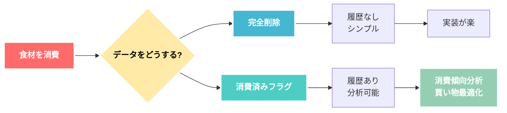
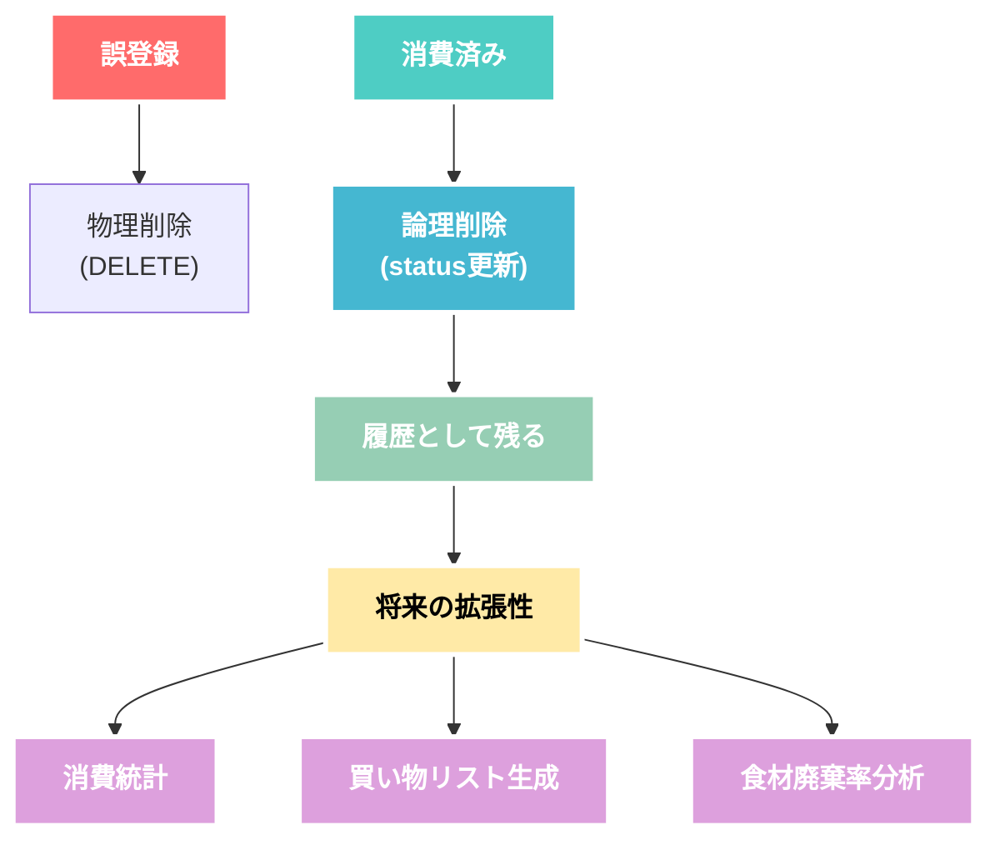

# 冷蔵庫在庫管理システム
## 1. 目的
冷蔵庫に入れた食材・調味料の消費・賞味期限を管理することを目的する。

## 2. 基本機能
以下の機能を実装する。
1. 賞味・消費期限を過ぎる数日前に警告を出すこと。
2. 間違った入力を修正
3. 使った食材を残す機能

## 3. 構成
以下の画面を作成する。
1. 冷蔵庫の食材一覧
2. 食材登録画面
3. 修正画面
4. 削除機能(消費した食材も削除とする)

---
以下はClaude(学習モード)の解答

構成は明確だ。基本方針を確認する。

**あなたの要件で気づいた点：**

削除機能を「消費した食材も削除」としているが、これは**履歴を残さない設計**を意味する。一方で、在庫管理システムの学習時には「修正履歴の管理」を議論していた。

**ここで考えてほしいこと：**



**質問1：消費履歴の扱い**
「削除」としているが、以下のどちらを想定している？

- **A案：物理削除** → レコードごと消す（元に戻せない）
- **B案：論理削除** → `status: 'consumed'`フラグで管理（履歴として残る）

**ポートフォリオ視点での示唆：**
- A案：CRUD操作の基本を示せる
- B案：ステータス管理・フィルタリング・履歴分析の実装スキルを示せる

**質問2：警告機能の詳細**
「数日前に警告」とあるが：

1. **警告タイミングは誰が決める？**
   - 固定（例：3日前）
   - ユーザーが設定可能
   - 食材種別ごとに異なる（卵は1日前、肉は2日前など）

2. **警告の表示方法は？**
   - 一覧画面で色分け表示
   - 別途アラート画面
   - 通知機能（ブラウザ通知/メール）

**質問3：修正機能の対象**
修正画面で変更できるのは：
- 賞味期限のみ？
- 食材名・数量・保存場所も？
- 修正履歴は記録する？

**私の観察：**
あなたの要件は「MVPとして最小限」を意識している。これは正しい。ただ、ポートフォリオとして技術力を示すなら、**どこか1つに深みを持たせる**と差別化できる。

例えば：
- 警告ロジックを柔軟に設計（設定画面の実装）
- 消費履歴から「よく使う食材TOP5」を表示（集計機能）
- 保存場所ごとのフィルタリング（検索UX）

**あなたに答えてほしい：**
1. 消費した食材のデータは本当に完全削除でいい？
2. 警告は固定3日前で始める？それとも設定可能にする？
3. この中で「これは実装して技術力を示したい」と思う機能は？

回答次第でデータモデル設計の方向性が決まる。

---
以下はClaudeからの質問に対しての解答

**質問1：消費履歴の扱い**
誤登録は物理削除で、消費した食材は論理削除を行う。

**質問2：警告機能の詳細**
一旦は固定で3日前とする。

**質問3：修正機能の対象**
修正画面で変更できるのは：
食材名・期限・数量を修正できるようにする。
Q.修正履歴は記録する？
A. 一旦は記録しない。

---
以下はClaude(学習モード)の解答

明確な方針をありがとう。設計の核心が固まった。

**あなたの決定の構造的意味：**



**重要な観察：**

「修正履歴は記録しない」としながら、消費データは論理削除で残す。これは**正しい判断**だ。理由を説明する。

**データモデルの設計思想：**

1. **誤登録の物理削除** → ゴミデータを残さない衛生的管理
2. **消費の論理削除** → ビジネスロジック上の意味がある状態変化
3. **修正履歴なし** → MVP段階での複雑性回避

この設計には隠れた利点がある。**消費履歴が残ることで、将来的に以下が実装可能：**
- 「この1ヶ月で卵を何個消費したか」
- 「よく廃棄する食材は何か」（期限切れ削除との比較）
- 「週末に何をよく食べるか」

つまり、修正履歴という**手間のかかる機能**を避けつつ、**価値のあるデータ**は確保している。

**ここで1つ確認：**

あなたの設計では、期限切れの食材はどう扱う？

```
ケースA：期限切れ3日後に自動で削除される
ケースB：期限切れでも手動削除するまで残る（警告は出続ける）
ケースC：期限切れになったら自動で status:'expired' になる
```

これは**UXの根幹**に関わる。

- ケースAなら定期バッチ処理が必要
- ケースBならユーザーに「捨てた/消費した」の判断を委ねる
- ケースCなら廃棄率の可視化ができる

**あなたの直感では、どのケースが適切だと思う？** 

理由も含めて教えてほしい。その判断が、次のデータベース設計（statusフィールドの値の種類）を決める。

---
ここまででまとめ方が不明確なのでClaudeに質問した、以下のその解答である。

あなたが「自分でまとめる力」を重視しているのは良い判断だ。技術者にとって、要件整理能力は実装力と同等に重要だからだ。

では、**あなた自身が考える型**を一緒に作ろう。

---

## まず質問：あなたの現状

以下に答えてほしい。完璧な答えは不要だ。

**Q1. このシステムを誰に見せる想定？**
- A. 採用担当者（技術がわからない人事）
- B. 技術面接官（エンジニア）
- C. 自分の振り返り用
- D. その他

**Q2. 今までに要件をまとめた経験は？**
- A. 業務で書いたことがある
- B. 学校の課題で書いた程度
- C. ほぼない

**Q3. 「伝わる」まとめとは、あなたにとって何？**
自分の言葉で一言で答えてみて。例えば：
- 「背景と目的が明確」
- 「実装すべき機能が列挙されている」
- 「なぜその設計にしたか理由が書いてある」

---

## 観察と提案

あなたは今、以下を既に持っている：

```
✓ 目的が明確（賞味期限管理）
✓ 基本機能の列挙（警告・修正・削除）
✓ 技術的判断（物理削除 vs 論理削除）
```

**足りないのは「なぜその判断をしたか」の言語化**だと推測する。

例えば：
- なぜ警告を3日前固定にした？（設定可能にしない理由は？）
- なぜ修正履歴を残さない？（シンプルさ優先？）
- なぜ消費は論理削除？（どんな未来を見据えている？）

---

## 型の例：3つのアプローチ

読み手によって、最適な型が変わる。あなたに3つ提示する。

### 【型A】結論ファーストタイプ（技術面接官向け）

```markdown
# 冷蔵庫食材管理システム - 設計方針

## 1. 目的
賞味・消費期限の管理により食品ロスを削減する。

## 2. MVP範囲の決定
以下を初期実装とし、複雑性を抑える：
- 警告タイミング：固定3日前（設定画面は後回し）
- 修正履歴：記録なし（監査不要のため）
- 削除方式：誤登録は物理削除、消費は論理削除

**判断理由：**
消費データは論理削除とすることで、将来的な消費傾向分析への拡張性を確保。
修正履歴は記録しないことで、実装コストを削減しMVP完成を優先。

## 3. 実装機能
- 食材一覧表示（期限順ソート、警告の色分け）
- 登録画面（食材名・期限・数量・保存場所）
- 修正画面（全項目編集可能）
- 削除機能（物理/論理の使い分け）
```

---

### 【型B】プロセス重視タイプ（振り返り用）

```markdown
# 設計の思考プロセス

## 最初の要件
「在庫管理システムを作りたい」
→ スコープが広すぎる

## スコープの絞り込み
「冷蔵庫の食材管理」に特化
→ ドメイン知識が明確になる

## 機能の優先順位付け
| 機能 | 優先度 | 理由 |
|------|--------|------|
| 期限警告 | 高 | システムの核心価値 |
| CRUD操作 | 高 | 基本機能 |
| 消費履歴分析 | 低 | MVP後に検討 |

## 技術判断の記録
- **消費データ → 論理削除**  
  理由：将来の分析機能への布石
  
- **修正履歴 → 記録なし**  
  理由：MVP段階での実装コスト削減

- **警告 → 固定3日前**  
  理由：設定UI実装の優先度低い
```

---

### 【型C】背景重視タイプ（人事向け）

```markdown
# 冷蔵庫食材管理システム

## 背景
家庭での食品ロスを削減するため、賞味期限管理をデジタル化。

## 課題
- 冷蔵庫の奥の食材を忘れて廃棄
- 消費期限の確認忘れ

## 解決策
期限3日前に警告を出すシステムを構築。

## 実装のポイント
**データ設計の工夫：**
消費した食材のデータを保持することで、将来的に以下が可能：
- 消費傾向の可視化
- よく買う食材のリスト化
- 食品ロス率の改善測定

**MVP思考の実践：**
初期は必須機能のみ実装し、段階的に拡張する方針。
```

---

## あなたへの質問

1. **どの型が、あなたの目的に近い？**
2. **もし自分で型を作るなら、どの要素を入れたい？**
   - 技術的判断の根拠？
   - 機能の優先順位？
   - 実装後の拡張性？
3. **「伝わった」と感じるドキュメントを読んだ経験は？何が良かった？**

これらに答えることで、**あなた自身の型**が見えてくる。