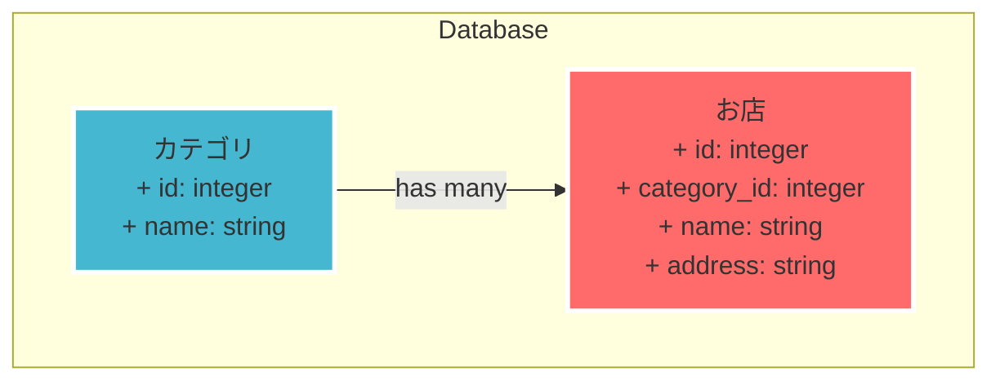

チャット名称：**Railsアプリ作成の記録**
要約：Railsでカテゴリと店舗リストを作成する手順をテキスト化。

-----

### 概要

提供された動画の内容を、コマンド、ファイル、ブラウザ操作の順に沿ってテキスト化します。この動画は、Railsフレームワークを用いてウェブアプリケーションを構築するチュートリアルの一部であり、「カテゴリーリスト」と「お店リスト」の作成手順を具体的に示しています。

-----

### 背景と設計思想

このチュートリアルでは、ランチマップというアプリケーションを構築しています。その第一歩として、お弁当屋さんなどの「お店リスト」と、ラーメン、イタリアンといった「カテゴリリスト」を作成します。

**設計思想**

  - **依存関係**: 「お店」は「カテゴリ」に属するため、先に「カテゴリ」をデータベースに設定する必要があります。これにより、後から「お店」にカテゴリ情報を紐づけることができます。
  - **スキャフォールド**: Railsの`rails generate scaffold`コマンドを使用することで、モデル、コントローラ、ビューといった一連のCRUD（Create, Read, Update, Delete）機能を自動生成し、開発を迅速に進めます。

-----

### 手順

1.  **ランチマップディレクトリへの移動**

      - ターミナルで`cd lunchmap`コマンドを実行し、作業ディレクトリへ移動します。

2.  **カテゴリリストの作成**

      - **コマンド実行**: `rails generate scaffold category name:string`
          - `scaffold`: 関連するファイル一式を自動生成します。
          - `category`: モデル名（テーブル名）を指定します。
          - `name:string`: `name`というカラムを文字列型(`string`)で作成します。
      - **データベース設定**: `rails db:migrate`
          - 自動生成されたマイグレーションファイルに基づいて、データベースに`categories`テーブルを作成します。
      - **動作確認**: `rails s -b 0.0.0.0`
          - Webサーバーを起動します。
      - **ブラウザ操作**: `http://paiza-app-cloud:3000/categories`にアクセスします。
          - 「Categories」ページが表示されることを確認します。
      - **データ登録**:
          - 「New Category」をクリック。
          - 「Name」に「ラーメン」と入力し、「Create Category」をクリック。
          - リストに「ラーメン」が追加されたことを確認します。
          - 同様に「イタリアン」も登録します。

3.  **お店リストの作成**

      - **Webサーバー停止**: ターミナルで`Ctrl + C`を押してサーバーを停止します。
      - **コマンド実行**: `rails generate scaffold shop category_id:integer name:string address:string`
          - `scaffold`: 関連するファイル一式を自動生成します。
          - `shop`: モデル名（テーブル名）を指定します。
          - `category_id:integer`: `category_id`というカラムを整数型(`integer`)で作成し、カテゴリとの関連付けを行います。
          - `name:string`: `name`というカラムを文字列型(`string`)で作成します。
          - `address:string`: `address`というカラムを文字列型(`string`)で作成します。
      - **データベース設定**: `rails db:migrate`
          - `shops`テーブルを作成します。
      - **動作確認**: `rails s -b 0.0.0.0`
          - Webサーバーを起動します。
      - **ブラウザ操作**: `http://paiza-app-cloud:3000/shops`にアクセスします。
          - 「Shops」ページが表示されることを確認します。
      - **データ登録**:
          - 「New Shop」をクリック。
          - 「Category」に`1`（ラーメンのID）、「Name」に「パイザ亭」と入力し、「Create Shop」をクリック。
          - リストに「パイザ亭」が追加されたことを確認します。

-----

### 図解

Mermaid形式で、今回構築したデータベースの構造を表現します。

**解説**:

  - `Categories`テーブルは、`name`（カテゴリ名）を文字列で保持します。
  - `Shops`テーブルは、`name`（店名）と`address`（住所）を文字列で保持します。
  - **`category_id: integer`** が、`Categories`テーブルとの関連付けを担う外部キーです。これにより、各「お店」がどの「カテゴリ」に属するかの情報を保持します。

-----

### まとめ

この動画では、Railsの**スキャフォールド機能**と**データベースマイグレーション**を活用して、Webアプリケーションの基本となるカテゴリリストとお店リストを迅速に作成する方法を学びました。自動生成された機能により、ユーザーは手軽にデータの登録・閲覧ができるようになります。次のステップでは、これらのリストを論理的に関連付ける方法について解説される予定です。