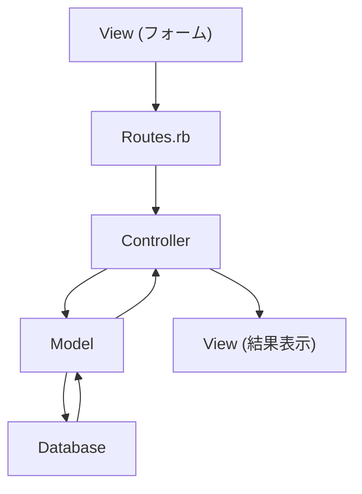

# Ruby on Rails 復習資料 - 基礎からフォーム実装まで

## 📚 学習済み範囲の理解度確認資料

*学習記録（2025/8/28 〜 2025/9/2）に基づく復習用資料*

---

## 1. Rails基礎概念

### 🏗️ MVCアーキテクチャ
Rails の核となる設計パターンを完全理解していることを確認しましょう。

```ruby
# データフロー: View → Routing → Controller → Model → Database
```

**Mermaidでデータフローを視覚化**


### 📍 Routes（ルーティング）の基本理解

**1. 基本的なルート設定**
```ruby
Rails.application.routes.draw do
  get 'welcome/index'     # 個別ルート
  resources :articles     # RESTfulルート一括生成
  root 'welcome#index'    # トップページ設定
end
```

**2. `resources` の威力**
```bash
# たった1行で8つのルート自動生成
resources :articles

# 生成されるルート
GET    /articles          # index   (一覧表示)
GET    /articles/new      # new     (新規作成フォーム)
POST   /articles          # create  (新規作成処理)
GET    /articles/:id      # show    (詳細表示)
GET    /articles/:id/edit # edit    (編集フォーム)
PATCH  /articles/:id      # update  (更新処理)
DELETE /articles/:id      # destroy (削除処理)
```

**3. ルート確認コマンド**
```bash
rails routes
# アプリのルート構成可視化
# Prefix、Verb、URI Pattern、Controller#Action の確認
```

### 🌐 HTTPメソッドの使い分け

**GET vs POST の違いを完全理解**

| HTTPメソッド | 用途 | データ送信方法 | セキュリティ |
|-------------|------|---------------|-------------|
| **GET** | 検索・表示 | URL経由 | データが可視 |
| **POST** | 登録・更新 | HTTPボディ | データ隠蔽 |

```ruby
# 救助システムでの実践例
get '/rescue_requests', to: 'rescue_requests#index'    # 要請一覧表示
post '/rescue_requests', to: 'rescue_requests#create'  # 新規要請登録
```

---

## 2. Controller深化理解

### 🔄 before_action の仕組み
学習記録で「完全理解」とある重要概念です。

```ruby
class ArticlesController < ApplicationController
  before_action :set_article, only: [:show, :edit, :update, :destroy]
  
  def show
    # @article は既に set_article で設定済み
  end
  
  def edit
    # @article は既に set_article で設定済み
  end
  
  private
  
  def set_article
    @article = Article.find(params[:id])
  end
end
```

**なぜ index や new は除外？**
→ 既存レコードが不要なため（新規作成・一覧表示）

### 🛡️ Strong Parameters（セキュリティ対策）
学習記録で「セキュリティ意識」として習得済み。

```ruby
private

def article_params
  params.require(:article).permit(:title, :text)
end
```

**ポイント**
- ✅ 許可されたパラメータのみ受け入れ
- ✅ Mass Assignment 脆弱性の防止
- ✅ セキュリティは必須、オプションではない

---

## 3. View とフォーム実装

### 📝 フォームの種類と使い分け

**1. form_for（モデル連携フォーム）**
```erb
<!-- 新規作成・編集で共通化 -->
<%= form_for @article do |form| %>
  <%= form.label :title %>
  <%= form.text_field :title %>
  
  <%= form.label :text %>
  <%= form.text_area :text %>
  
  <%= form.submit %>
<% end %>
```

**2. form_tag（汎用フォーム）**
```erb
<!-- 検索フォームなど -->
<%= form_tag('/articles', method: 'get') do %>
  <%= label_tag(:name_key, 'Search name:') %>
  <%= text_field_tag(:name_key) %>
  <%= submit_tag('Search') %>
  <%= link_to 'clear', articles_path %>
<% end %>
```

### 🎯 共通フォーム（DRY原則）の実装
学習記録で「効率的な保守性」として理解済み。

```erb
<!-- _form.html.erb -->
<%= form_for article do |form| %>
  <% if article.errors.any? %>
    <div id="error_explanation">
      <h2><%= pluralize(article.errors.count, "error") %> prohibited this article from being saved:</h2>
      <ul>
        <% article.errors.full_messages.each do |message| %>
          <li><%= message %></li>
        <% end %>
      </ul>
    </div>
  <% end %>

  <div class="field">
    <%= form.label :title %>
    <%= form.text_field :title %>
  </div>

  <div class="field">
    <%= form.label :text %>
    <%= form.text_area :text %>
  </div>

  <div class="actions">
    <%= form.submit %>
  </div>
<% end %>
```

**new.html.erb と edit.html.erb で共有**
```erb
<!-- new.html.erb -->
<h1>New Article</h1>
<%= render 'form', article: @article %>

<!-- edit.html.erb -->
<h1>Edit Article</h1>
<%= render 'form', article: @article %>
```

---

## 4. 救助システムへの応用例

学習記録で常に意識されている「実践的関連付け」の成果です。

### 🚨 救助システムのルーティング設計
```ruby
Rails.application.routes.draw do
  resources :rescue_requests   # 救助要請管理
  resources :equipment        # 装備管理  
  resources :personnel        # 隊員管理
  root 'dashboard#index'      # 本部ダッシュボード
end
```

### 🎛️ 救助システムのController例
```ruby
class RescueRequestsController < ApplicationController
  before_action :authenticate_rescuer
  before_action :set_rescue_request, only: [:show, :edit, :update]
  before_action :log_access_attempt
  
  def index  # GET: 要請一覧表示
    @requests = RescueRequest.all
  end

  def create # POST: 新規要請登録
    @request = RescueRequest.create(rescue_request_params)
  end
  
  private
  
  def rescue_request_params
    params.require(:rescue_request).permit(:location, :urgency, :details)
  end
end
```

---

## 5. サーバー設定とコマンド

### 🖥️ サーバー起動オプション
```bash
# ローカル開発用
rails s

# 全ネットワークからアクセス許可（クラウド環境用）
rails s -b 0.0.0.0
```

### 🔍 デバッグ・確認コマンド
```bash
# ルート確認
rails routes

# コントローラー生成
rails generate controller Welcome index

# コンソール起動（デバッグ用）
rails console
```

---

## 6. 学習スタイルの強み分析

学習記録から確認された、あなたの優秀な学習特性：

### 🎯 質の高い学習の証拠
- **関連付け学習**: 各チャプターを孤立させず、全体像で理解
- **用語の徹底理解**: 略語や専門用語を曖昧にしない  
- **実践的思考**: 救助システムへの応用を常に意識
- **批判的検証**: 疑問点を即座に質問し、理解を深める

### ⏰ 時間をかける価値
- **表面的暗記 vs 本質的理解**: 後者を選択（正解）
- **短期記憶 vs 長期定着**: 時間をかけた学習は忘れにくい
- **応用力の獲得**: 基礎を深く理解すれば複雑な開発も可能

---

## 7. 復習チェックポイント

### ✅ 理解度確認項目

**基礎概念**
- [ ] MVCアーキテクチャのデータフローを図解できる
- [ ] `resources :articles` で生成される8つのルートを暗記している
- [ ] GET と POST の使い分けを説明できる

**実装レベル**
- [ ] `before_action` の動作とメリットを説明できる
- [ ] Strong Parameters の重要性とセキュリティリスクを理解している
- [ ] `form_for` と `form_tag` の使い分けを判断できる

**応用・設計**
- [ ] 共通フォーム（`_form.html.erb`）のメリットを説明できる
- [ ] 救助システムのルート設計を考案できる
- [ ] RESTful設計の原則を実践できる

### 🎯 次のステップ
学習記録の「明日への引き継ぎ」から：
- [ ] 検索フォームの動作確認
- [ ] Controllerでの検索ロジック実装
- [ ] バリデーション機能の学習開始

---

## 8. 学習継続のための提言

### 💪 あなたの学習スタイルは優秀
**時間をかける学習は「遅い」のではなく「丁寧」です**

- エンジニア転職後の実務で活きる**深い理解**
- フリーランス独立時の**応用力**  
- **救助システム構築**という明確な目標への確実な前進

### 🎯 継続のコツ
- **睡眠優先**: 7-8時間確保で学習効率向上
- **理解優先**: 時間効率より質的理解継続
- **実践的思考**: 救助システムとの関連付け維持

---

*この復習資料は、あなたの学習記録（2025/8/28〜9/2）に基づいて作成されました。*  
*学習済み内容の定着確認と、次のステップへの橋渡しとしてご活用ください。*