**チャット名**：Rails転職学習計画
**要約**：paiza軸で12週130時間。Rails就職力を可視化。

---

## 概要

**主題**：Rails初学者の転職直結カリキュラム。
**理由**：求人要件はRails＋Git＋SQL＋運用。
**具体例**：12週プランと成果物3件を提示。
**まとめ**：130時間で「可視の実力」を作る。

---

## 背景と設計思想

* **主題**：実務要件を逆算して学ぶ。
* **理由**：面接は成果と再現性を重視。
* **具体例**：CRUD→認証→テスト→CI→運用。
* **まとめ**：学習＝成果物＋指標で示す。

---

## 手順（12週・目安10〜12h/週・合計≈130h）

**週1**：Web基礎と環境整備（10h）

* HTML/CSS概観。HTTPの流れを理解。
* VS Code拡張、rbenv、Git設定。
* 成果：静的LPとGitHub初Push。

**週2**：Linuxとシェル（10h）

* 基本コマンド、権限、パイプ。
* 成果：Dotfiles管理とalias整備。

**週3**：SQL/RDB基礎（10h）

* SELECT/INSERT/JOIN/INDEX。
* 成果：SQLite→PostgreSQLに移行。

**週4**：Ruby基礎＋paiza C準備（12h）

* 変数、配列、ハッシュ、ブロック。
* 成果：paiza問題C相当10問。

**週5**：Sinatraで薄いMVC（10h）

* ルーティング、ERB、CRUD実装。
* 成果：ミニ掲示板をHeroku互換PaaS。

**週6**：Rails入門（12h）

* MVC、ER図、scaffold理解。
* 成果：ToDo CRUD＋RDB正規化。

**週7**：Rails実務化1（12h）

* 認証（Devise）と認可（Pundit）。
* 成果：ユーザー別リソース保護。

**週8**：Rails実務化2（10h）

* バリデーション、N+1対策、キャッシュ。
* 成果：Bullet導入と改善PR。

**週9**：テストと品質（12h）

* RSpec、FactoryBot、SystemTest。
* 成果：主要ユースケースに網羅率。

**週10**：CI/CDと運用（10h）

* GitHub Actionsで自動テスト。
* 成果：main保護とCIバッジ表示。

**週11**：Webセキュリティ（10h）

* CSRF、XSS、SQLi、OWASP。
* 成果：脆弱化ブランチ→修正PR。

**週12**：総仕上げと面接準備（12h）

* ポートフォリオ整備とSTAR法。
* 成果：職務経歴書とデモ動画。

---

## 図解（依存関係）

```mermaid
flowchart LR
A["Web基礎(HTML/CSS)"] --> B["HTTP/REST概念"]
B["HTTP/REST概念"] --> C["Linux/シェル"]
C["Linux/シェル"] --> D["Git/GitHub"]
D["Git/GitHub"] --> E["SQL/RDB"]
E["SQL/RDB"] --> F["Ruby基礎(+paiza C)"]
F["Ruby基礎(+paiza C)"] --> G["Sinatra(薄いMVC)"]
G["Sinatra(薄いMVC)"] --> H["Rails MVC/ER/CRUD"]
H["Rails MVC/ER/CRUD"] --> I["Rails実務:認証/性能"]
I["Rails実務:認証/性能"] --> J["テスト/CI/CD"]
J["テスト/CI/CD"] --> K["セキュリティ/運用/デプロイ"]
```

---

## 成果物（転職に効く3点セット）

1. **CRUDアプリ**：タスク管理

* 要件：CRUD、pagination、検索。
* 追加：ER図、README、スクショ。

2. **業務風API**：JSON＋JWT

* 要件：REST、認可、RateLimit。
* 追加：OpenAPI仕様とcurl例。

3. **本番運用版**：認証＋テスト

* 要件：Devise、Pundit、RSpec。
* 追加：CI、監視、パフォ計測。

---

## 指標（KPIと重み）

* **GitHub稼働度 20%**：週10+コミット。
* **paiza C達成 20%**：C問題安定合格。
* **テスト整備 20%**：主要E2Eを自動化。
* **性能/品質 20%**：N+1排除とTTFB改善。
* **運用再現性 20%**：CI緑化とデプロイ。

合格ライン：総合80点以上を目標。

---

## 推奨学習素材（提示文から推定）

* **最優先**：Web開発ストーリー(Ruby)。
* **補助**：Cランク獲得ストーリー(Ruby)。
* **必須**：新・Linux、SQL、Git入門。
* **加点**：Webセキュリティ入門(PHP)。
* **管理**：情報処理マネジメント編。

※時間表記に差異あり。実測で調整。

---

## 時間計画と配分

* 提示合計は約133時間想定。
* 各STEP加算で約122.5時間。
* 余剰10時間をテスト強化に配分。
* 週12×11hで達成を基準とする。

---

## 応募準備チェックリスト

* READMEに環境構築手順を完備。
* ER図、シーケンス図を添付。
* CIバッジとカバレッジを表示。
* デモ動画90秒を用意。
* IssueとPRで改善履歴を提示。

---

## 追加アドバイス（あなた向け最適化）

* Python経験はAPI設計に活きる。
* VBA経験は要件定義で強み。
* Linux操作はSRE的観点を意識。
* 面接では改善PRを時系列で説明。
* 学習ログはObsidianで日次化。

---

## まとめ

**主題**：成果可視化で内定率を上げる。
**理由**：Rails実務は再現性が鍵。
**具体例**：12週計画と3成果物で示す。
**結論**：130時間で転職準備を完了。

---

必要なら、週次タスクをタスク管理に落とし込みます。
ポートフォリオ要件のテンプレも用意できます。
