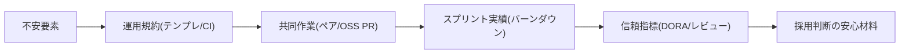

**チャット名**：年齢×未経験の訴求設計
**要約**：33歳の強みとチーム適性を4週で可視化。

---

## 概要

**主題**：年齢と未経験を逆手に取る証拠構築。
**理由**：採用は「即戦力」より「再現性」。
**具体例**：4週でチーム開発の証跡を作る。
**まとめ**：実物＋指標で不安を解消する。

---

## 背景と設計思想

* **主題**：不利要素は証拠で上書きする。
* **理由**：主観より客観データが効く。
* **具体例**：PR履歴・レビュー・CI緑化。
* **まとめ**：成果物×運用×対人で示す。

---

## 手順（4週スプリント｜合計40〜50h）

**週1：基盤整備と規約化（10–12h）**

* GitHubに「チーム擬似プロジェクト」を作成。
* 追加：**PRテンプレ・Issueテンプレ・CODEOWNERS**。
* RuboCop／RSpec／SimpleCov／Brakeman／bundler-audit。
* CI：GitHub Actionsでlint＋test＋security。
* **成果**：リポジトリが**合意可能な運用**を内包。

**週2：共同作業の実演（10–12h）**

* 2名以上と**ペアプロ／モブプロ**を2回実施。
* 収集：録画リンク、要約、決定事項、フォロー課題。
* OSSへ**good first issue**で2PR提出（小さく速く）。
* **成果**：外部レビューと会話ログの可視化。

**週3：1スプリントの完走（10–12h）**

* 1週間の**スクラム擬似運用**を実施。
* Backlog→見積→実装→レビュー→振り返り。
* 記録：バーンダウン、WIP、LTtC（後述指標）。
* **成果**：**プロセス耐性**の数字化。

**週4：品質と信頼の担保（10–14h）**

* 本番相当デプロイ（Render/Fly.io等）。
* 監視：Uptimeとエラーログ、SLO仮設定。
* **障害訓練**：意図的バグ→インシデント対応録。
* まとめ：**Teamability Evidence Pack**を作成。

---

## 図解（証拠→安心の流れ）



---

## 必要要素セット（面接で刺さる中身）

### 1) **技術運用**

* GitHub Flow／**Conventional Commits**／**Semantic Versioning**。
* CI緑化、**Rubocop/Brakeman/SimpleCov**のバッジ。
* **ADR**（Architecture Decision Record）を2本以上。

### 2) **チーム実践**

* **PRのやり取り**：指摘→修正→再レビューの3サイクル。
* **レビュー基準**：設計/可読性/テスト/リスクの観点。
* **同期/非同期の住み分け**：MTG15分、残りはIssueで。

### 3) **プロセス計測**

* **DORA軽量版**：

  * 変更頻度（週3+）、
  * 変更リードタイム（PR作成→マージ<48h）、
  * 失敗率（ロールバック0〜1/スプリント）、
  * 復旧時間（<2h）。
* **レビュー応答時間**（初回コメント<12h）。

### 4) **ビジネス適合**

* 課題→仮説→実装→検証の**小さなPDCA**。
* チケットは**業務言語**で記述（例：件名「請求CSV重複」）。

### 5) **33歳の価値**

* 前職経験×**責任感**×**継続力**。
* **要件定義/折衝**の素地（VBA/GIS経験を事例化）。
* **学習曲線の短さ**（自走と再現性の強調）。

---

## Teamability Evidence Pack（提出物の中身）

* **README**：環境構築、運用規約、役割分担。
* **/docs**：ER図、シーケンス、ADR、SLO草案。
* **/process**：スプリント計画、**振り返り**議事録。
* **/reviews**：PRリンク集と抜粋、改善の差分画像。
* **/incidents**：障害レポート（原因/影響/再発防止）。
* **実演リンク**：デプロイURL、**90秒デモ動画**。
* **推薦1行**：ペア相手からの短文推薦（LinkedIn/GitHub）。

---

## リポジトリ設計（最小構成）

```
root
├─ README.md            # 運用・セットアップ
├─ CONTRIBUTING.md      # ルール/レビュー観点
├─ .github/
│  ├─ workflows/ci.yml  # lint/test/security
│  ├─ ISSUE_TEMPLATE.md
│  └─ PULL_REQUEST_TEMPLATE.md
├─ docs/
│  ├─ ER.drawio.png
│  ├─ sequence.md
│  └─ adr-0001-auth.md
├─ process/
│  ├─ sprint-plan-01.md
│  └─ retro-01.md
└─ incidents/
   └─ 2025-08-xx-login-timeout.md
```

---

## KPIと重み（採用判断に直結）

* **共同開発証跡 30%**：外部レビュー3件以上。
* **CI/品質 25%**：lint/test/securityフル緑化。
* **プロセス遵守 20%**：テンプレ活用とSLA順守。
* **配信実績 15%**：本番相当デプロイ継続運用。
* **学習継続 10%**：週報と改善ログの蓄積。
  **合格ライン**：総合80点以上で提出。

---

## 33歳×未経験を「欲しい人材」にする要素

1. **再現性**：同じやり方で毎回仕上がる。
2. **低リスク**：レビュー負荷を自分で下げる。
3. **速習性**：未知を48hで叩き台にする。
4. **業務言語**：技術を業務目的に翻訳できる。
5. **責任感**：障害時の**初動と事後**が速い。

**面接での一句**

* 「経験は浅いが、**運用と改善は手順化**済みです。」

---

## 面接トーク（STAR雛形：チーム適性）

* **S**：要件曖昧な機能要望が到着。
* **T**：1日で仕様化、3日で安全に出す。
* **A**：Issue化→見積→PR分割→CI→段階リリース。
* **R**：障害0、LT短縮、レビュー時間30%減。

---

## 具体例（PRテンプレ要点）

* 目的／背景、変更範囲、非機能影響。
* テスト観点（正常・異常・境界）。
* ロールバック手順、監視項目、スクショ。
* 関連Issue、チケット番号、**レビュー依頼先**。

---

## 4週後の提出チェック

* [ ] 外部レビュー3件以上のURL。
* [ ] CIバッジ、Coverage、Brakeman結果。
* [ ] バーンダウン画像とレトロまとめ。
* [ ] インシデント報告と再発防止。
* [ ] 90秒デモ動画とREADME整備。

---

## まとめ

**主題**：33歳の強みを「運用力」で示す。
**理由**：未経験の不安は証拠で消える。
**具体例**：4週でEvidence Packを構築。
**結論**：**実物＋指標＝採用の安心**を作る。

---

必要なら、PR/Issue/CIテンプレを即納します。
ペアプロ相手の募集文も用意できます。
